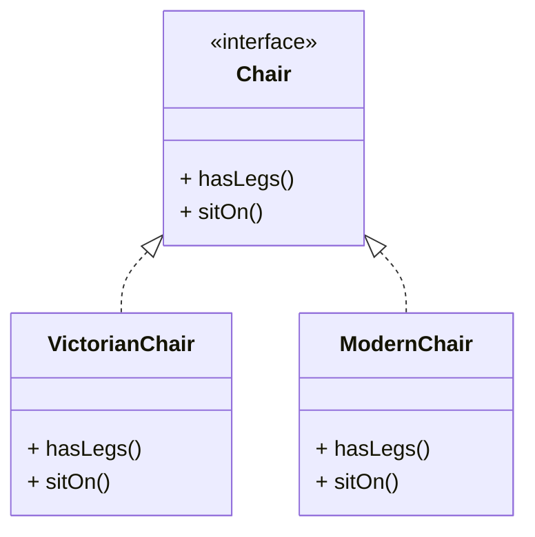
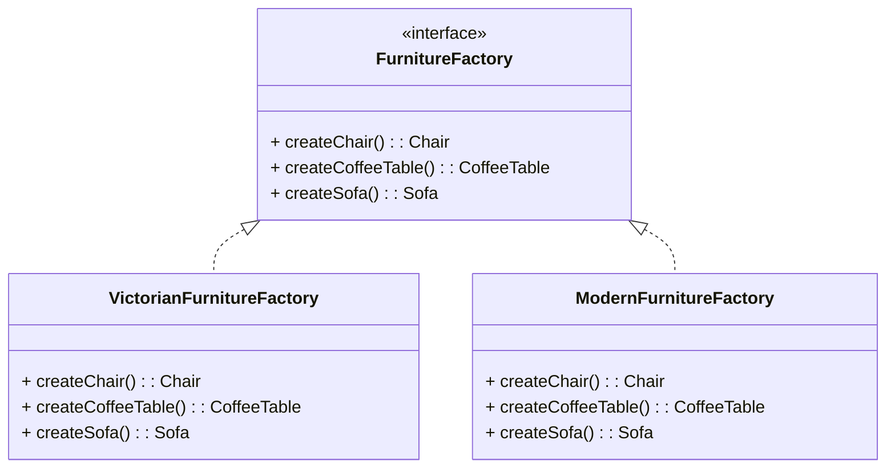

抽象工厂模式是一种创建型设计模式,它能创建一系列相关的对象,而无需指定具体

抽象工厂模式建议为系列中的每件产品明确声明接口.然后,确保所有产品变体都继承这些接口



同一对象的所有变体都必须放置在同一个类层次结构之中.

<!--more-->

接下来,需要声明抽象工厂--包含系列中所有产品构造方法的接口.这些方法



## 代码示例

```typescript
// 系列产品中的特定产品必须有一个基础接口.所有产品变体都必须实现这个接口
interface Button {
  render(): void;
}

// 具体产品由相应的具体工厂创建
class WindowsButton implements Button {
  render(): void {
    console.log("Rendering Windows button...");	// 根据 windows 样式渲染按钮
  }
}

class MacButton implements Button {
  render(): void {
    console.log("Rendering Mac button..."); // 根据 MacOS 样式渲染按钮
  }
}

// 另一个产品的基础接口.所有产品都可以互动, 但是只有相同具体变体的产品之间才能够正确地进行交互
interface Checkbox {
  render(): void;
}

class WindowsCheckbox implements Checkbox {
  render(): void {
    console.log("Rendering Windows checkbox...");	// 根据 Windows 样式渲染复选框
  }
}

class MacCheckbox implements Checkbox {
  render(): void {
    console.log("Rendering Mac checkbox..."); // 根据 MacOS 样式渲染复选框
  }
}

// 抽象工厂接口声明了一组能返回不同抽象产品的方法.这些产品属于同一个系列
// 且在高层主题或概念上具有相关性.同系列的产品通常能够相互搭配使用.
// 系列产品可有多个变体,但不同变体的产品不能搭配使用
interface GUIFactory {
  createButton(): Button;
  createCheckbox(): Checkbox;
}

// 具体工厂可生成属于同一变体的系列产品.工厂会确保其创建的产品能相互搭配使用
// 具体工厂方法签名会返回一个抽象产品,但在方法内部则会对具体产品进行实例化
class WindowsGUIFactory implements GUIFactory {
  createButton(): Button {
    return new WindowsButton();
  }

  createCheckbox(): Checkbox {
    return new WindowsCheckbox();
  }
}

// 每个具体工厂中都会包含一个相应的产品变体
class MacGUIFactory implements GUIFactory {
  createButton(): Button {
    return new MacButton();
  }

  createCheckbox(): Checkbox {
    return new MacCheckbox();
  }
}

enum OSType {
  WINDOWS,
  MAC
}

// 客户端代码仅通过抽象类型(GUIFactory, Button 和 Checkbox) 使用工厂和产品
// 这让你无需修改任何工厂或产品子类就能将其传递给客户端代码
class GUIFactoryProvider {
  static getFactory(osType: OSType): GUIFactory {
    switch (osType) {
      case OSType.WINDOWS:
        return new WindowsGUIFactory();
      case OSType.MAC:
        return new MacGUIFactory();
      default:
        throw new Error("Unsupported OS type");
    }
  }
}

// Example usage:
// 程序会根据当前配置或环境设定选择工厂类型,并在运行时创建工厂(通常在初始化阶段)
const osType = OSType.WINDOWS;
const factory = GUIFactoryProvider.getFactory(osType);

const button = factory.createButton();
const checkbox = factory.createCheckbox();

button.render(); // Output: Rendering Windows button...
checkbox.render(); // Output: Rendering Windows checkbox...
```

## 适用场景

- 代码需要与多个不同系列的相关产品交互,但是由于无法提前获取相关信息,或者出于对未来拓展性的考虑,你不希望代码基于产品的具体类进行构建,在这种情况下,可以使用抽象工厂
- 如果有一个基于一组抽象方法的类,且其主要功能因此变得不明确,那么在这种情况下可以考虑使用抽象工厂模式

## 优点

- 可以确保同一工厂生成的产品相互匹配
- 可以避免客户端和具体产品代码的耦合
- 单一职责原则. 你可以将产品生成代码抽取到同一位置,使得代码易于维护
- 开闭原则. 向应用程序中引入新产品变体时, 你无需修改客户端代码

## 缺点

- 由于采用该模式需要向应用中引入众多接口和类, 代码可能会比之前更加复杂

## 参考

[Refactoringguru.cn 抽象工厂模式](https://refactoringguru.cn/design-patterns/abstract-factory)
