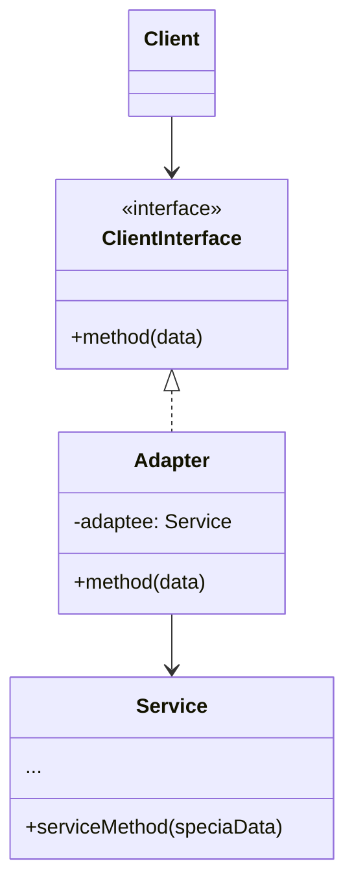
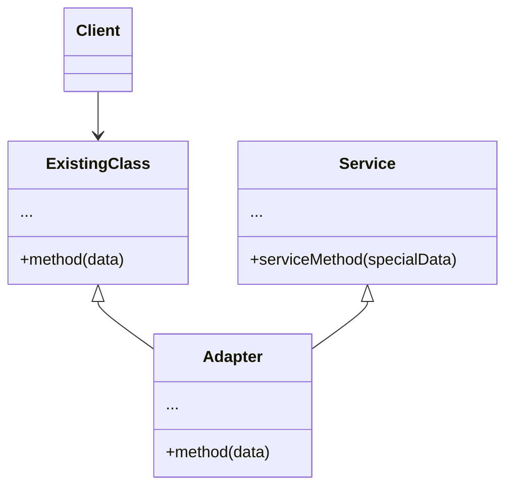

**适配器模式**是一种结构型设计模式，它能使接口不兼容的对象能够相互合作。

运作方式如下：

- 适配器实现与其中一个现有对象兼容的接口
- 现有对象可以使用该接口安全地调用适配器方法
- 适配器方法被调用后将以另一个对象兼容的格式和顺序将请求传递给该对象

<!--more-->

## 适配器模式结构

### 对象适配器

使用构成原则：适配器实现了其中一个对象的接口，并对另一个对象进行封装。



- **客户端（Client）** 是包含当前程序业务逻辑的类
- **客户端接口（Client Interface）** 描述了其他类与客户端代码合作时必须遵循的协议
- **服务（Service）** 中有一些功能类（通常来自第三方或遗留系统）。客户端与其接口不兼容，因此无法直接调用其功能
- **适配器（Adapter）** 是一个可以同时与客户端和服务交互的类：它在实现客户端接口的同时封装了服务对象。适配器接受客户端通过适配器接口发起的调用，并将其转换为适用于被封装服务对象的调用

客户端代码只需通过接口与适配器交互即可，无需与具体的适配器耦合。

### 类适配器

这一实现使用了继承机制：适配器同时继承两个对象的接口。



- **类适配器** 不需要封装任何对象，因为它同时继承了客户端和服务的行为。适配功能在重写的方法中完成。最后生成的适配器可替代已有的客户端类进行使用

## 代码示例

```typescript
// Adaptee
class FahrenheitSensor {
  getTemperature(): number {
    const temperature = parseFloat(prompt("Enter temperature in Fahrenheit: ") || "0");
    return temperature;
  }
}

// Target interface
interface CelsiusSensor {
  getTemperature(): number;
}

// Adapter
class FahrenheitToCelsiusAdapter implements CelsiusSensor {
  private fahrenheitSensor: FahrenheitSensor;

  constructor(fahrenheitSensor: FahrenheitSensor) {
    this.fahrenheitSensor = fahrenheitSensor;
  }

  getTemperature(): number {
    const fahrenheitTemp = this.fahrenheitSensor.getTemperature();
    const celsiusTemp = (fahrenheitTemp - 32) * 5/9;
    return celsiusTemp;
  }
}

// Client code
const fahrenheitSensor = new FahrenheitSensor();
const celsiusSensor = new FahrenheitToCelsiusAdapter(fahrenheitSensor);

console.log(`Temperature in Celsius: ${celsiusSensor.getTemperature()}`);
```


## 适用场景

- 希望使用某个类，但是其接口与其他代码不兼容时，可以使用适配器类
- 如果需要复用这样一些类，他们处于同一个继承体系，并且他们又有了额外的一些共同的方法，但是这些共同的方法不是所有在这一继承体系中的子类所具有的共性

## 优点

- 单一职责原则，你可以将接口或数据转换代码从程序主要业务逻辑中分离
- 开闭原则。只要客户端代码通过客户端接口与适配器进行交互，你就能在不修改现有客户端代码的情况下在程序中添加新类型的适配器

## 缺点

- 代码整体复杂度增加，因为需要新增一系列接口和类。有时直接更改服务类使其与其他代码兼容会更简单

## 参考

[Refactoringguru.cn 适配器模式](https://refactoringguru.cn/design-patterns/adapter)
