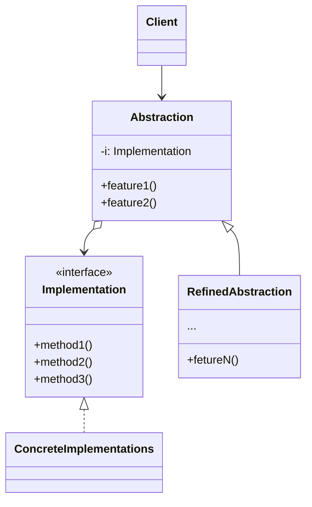

**桥接模式** 是一种结构型设计模式， 可将一个大类或一系列紧密相关的类拆分为抽象和实现两个独立层次结构，从而能在开发时分别使用

抽象部分（也被称为接口）是一些实现的高阶控制层。该层自身不完成任何具体的工作，它需要将工作委派给实现部分层（也被称为平台）



注意，这里提到的内容与编程语言中的接口或抽象类无关。它们并不是一回事



<!--more-->

## 桥接模式结构



- **抽象部分（abstraction）** 提供高层控制逻辑，依赖与完成底层实际工作的实现对象
- **实现部分（Implementation）** 为所有具体实现声明通用接口。抽象部分仅能通过在这里声明的方法与实现对象交互
- **具体实现（ConcreteImplementTations）** 中包括特定于平台的代码
- **精确抽象（RefinedAbstraction）** 提供控制逻辑的变体。与其父类伊朗，它们通过通用实现接口与不同的实现进行交互
- 通常情况下，**客户端（Client）** 仅关心如何与抽象部分合作。但是客户端需要将抽象对象与一个实现对象连接起来

## 代码示例

```typescript
// “抽象部分”定义了两个类层次结构中“控制”部分的接口。它管理者一个指向“实现部分”层次结构中对象的引用，并会将所有真实工作委派给该对象
interface Abstraction {
  operation(): void;
}

class ConcreteAbstraction implements Abstraction {
  private implementor: Implementor;

  constructor(implementor: Implementor) {
    this.implementor = implementor;
  }

  operation(): void {
    console.log("ConcreteAbstraction.operation");
    this.implementor.operationImpl();
  }
}

// “实现部分”接口声明了在所有具体实现类中通用的方法。它不需要与抽象接口相匹配。
// 实际上，这连个接口可以完全不一样。通常实现接口只提供原语操作，而抽象接口则会基于这些操作定义较高层次的操作
interface Implementor {
  operationImpl(): void;
}

// The ConcreteImplementorA class that implements the Implementor interface
class ConcreteImplementorA implements Implementor {
  operationImpl(): void {
    console.log("ConcreteImplementorA.operationImpl");
  }
}

// The ConcreteImplementorB class that implements the Implementor interface
class ConcreteImplementorB implements Implementor {
  operationImpl(): void {
    console.log("ConcreteImplementorB.operationImpl");
  }
}

// The client code
const implementorA: Implementor = new ConcreteImplementorA();
const abstractionA: Abstraction = new ConcreteAbstraction(implementorA);
abstractionA.operation();

const implementorB: Implementor = new ConcreteImplementorB();
const abstractionB: Abstraction = new ConcreteAbstraction(implementorB);
abstractionB.operation();
```

## 适用场景

- 如果你想要拆分或重组一个具有多重功能的庞杂类（例如能与多个数据库服务器进行交互的类），可以使用桥接模式
- 如果你希望在几个独立维度上扩展一个类，可使用该模式
- 如果你需要在运行时切换不同的实现方法，可使用桥接模式

## 优点

- 可以创建与平台无关的类和程序
- 客户端代码仅与高层抽象部分进行互动，不会接触到平台的详细信息
- 开闭原则。你可以新增抽象部分和实现部分，且它们之间不会相互影响
- 单一职责原则。抽象部分专注与处理高层逻辑，实现部分处理平台细节

## 缺点

- 对高内聚的类使用该模式可能会让代码更加复杂

## 参考

[Refactoringguru.cn 桥接模式](https://refactoringguru.cn/design-patterns/bridge)
