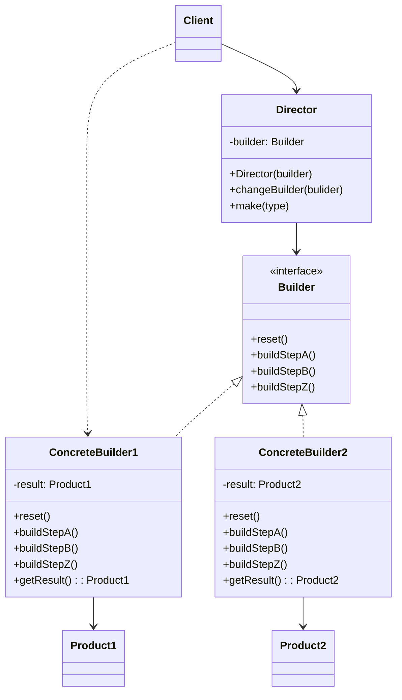

生成器模式是一种创建型设计模式,使你能够分步骤创建复杂对象.该模式允许你使用相同的创建代码生成不同类型和形式的对象.

生成器模式建议将对象构造代码从产品类中抽取出来, 并将其放在一个名为生成器的独立对象中.



> 生成器模式让你能够分步骤复杂对象.生成器不允许其他对象访问正在创建的产品

<!--more-->

- **生成器（Builder）** 接口声明在所有类型生成器中通用的产品构造步骤
- **具体生成器（Concrete Builders）** 提供构造过程的不同实现。具体生成器也可以构造不遵循通用接口的产品
- **产品（Products）** 是最终生成的对象。由不同生成器构造的产品无需属于同一类层次结构或接口
- **主管（Director）** 类定义调用构造步骤的顺序，这样你就可以创建和复用特定的产品配置
- **客户端（Client）** 必须将某个生成器对象与主管类关联。一般情况下，你只需通过主管类构造函数的参数进行一次性关联即可。此后主管类就能使用生成器对象完成后续所有的构造任务。但在客户端将生成器对象传递给主管类制造方法时还有另一种方式。在这种情况下，你在使用主管类生产产品时每次都可以使用不同的生成器

该模式会将对象构造过程划分为一组步骤, 比如和创建房门等.每次创建对象时,你都需要通过生成器对象执行一系列步骤. 重点在于你无需调用所有步骤, 而只需调用创建特定对象配置所需的那些步骤即可

当你需要创建不用形式的产品时,其中的一些构造步骤可能需要不同的实现.在这种情况下,你可以创建多个不同的生成器,用不同方式实现一组相同的创建步骤.然后你就可以在创建过程中使用这些生成器来生成不同类型的对象.

**主管**

可以进一步将用于创建产品的一系列生成器步骤调用抽取成为单独的主管类.主管类可定义创建步骤的执行顺序,而生成器则提供这些步骤的实现

严格来说, 程序中并不一定需要主管类.客户端代码可直接以特定顺序调用创建步骤.不过,主管类中非常适合放入各种例行构造流程,以便在程序中反复使用.

## 代码示例

只有当产品较为复杂且需要详细配置时, 使用生成器模式才有意义.

这里成员均为 类型, 只是为了减少示例代码.真实代码中使用真实的实例能更好的发挥生成器模式的能力

```ts
// 产品不一定需要实现同样的接口. 或继承自同一个基类.
class Car {
  seats: number
  engine: string
  tripComputer: string
  gps: string
}

class Manual {
  seats: number
  engine: string
  tripComputer: string
  gps: string
}

// 生成器接口声明了创建产品对象不同部件的方法
interface Builder {
  reset(): any
  setSeats(seat: string): any
  setEngine(engine: string): any
  setTripComputer(computer: string): any
  setGps(gps: string): any
}

// 具体生成器类型将遵循生成器接口并提供步骤的具体实现
// 可以有多个以不同方式实现的生成器变体
class CarBuilder implements Builder {
  private car: Car
  
  // 一个生成器示例必须包含一个在后续组装过程中使用的空产品对象
  constructor() {
    this.reset()
  }
  
  // reset 方法可清除正在生成的对象
  reset() {
    this.car = new Car()
  }
  
  // 所有生成步骤都会与同一个产品实例进行交互
  setSeats(seats: number) {
    this.car.serts = seats
  }
  
  setEngine(engine: string) {
    this.car.engine = engine
  }
  
  setTripComputer(computer: string) {
    this.car.tripComputer = computer
  }
  
  setGps(gps: string) {
    this.gps = gps
  }
  
  // 具体生成器需要自行提供获取结果的方法.
  // 这是因为不同类型的生成器可能会创建不遵循相同接口的,完全不同的产品.
  // 所以也就无法在生成器接口中声明这些方法
  
  getProduct(): Car {
    const car = this.car
    this.reset()	// 做好生成另一个产品的准备
    return car
  }
  
  // 通常在生成器实例将结果返回给客户端后,它们应该做好生成另一个产品的准备.
  // 因此生成器实例通常会在 `getProduct(获取产品)`方法主题末尾调用重置方法
  // 但是该行为不是必需的,你也可以让生成器等待客户端明确调用重置方法后再去处理之前的结果
}


class CarManualBuilder implements Builder {
  private manual: Manual
  
  // 一个生成器示例必须包含一个在后续组装过程中使用的空产品对象
  constructor() {
    this.reset()
  }
  
  // reset 方法可清除正在生成的对象
  reset() {
    this.manual = new Manual()
  }
  
  // 所有生成步骤都会与同一个产品实例进行交互
  setSeats(seats: number) {
    this.car.serts = seats
  }
  
  setEngine(engine: string) {
    this.car.engine = engine
  }
  
  setTripComputer(computer: string) {
    this.car.tripComputer = computer
  }
  
  setGps(gps: string) {
    this.gps = gps
  }
  
  // 具体生成器需要自行提供获取结果的方法.
  // 这是因为不同类型的生成器可能会创建不遵循相同接口的,完全不同的产品.
  // 所以也就无法在生成器接口中声明这些方法
  
  getProduct(): Car {
    const car = this.car
    this.reset()	// 做好生成另一个产品的准备
    return car
  }
  
  // 通常在生成器实例将结果返回给客户端后,它们应该做好生成另一个产品的准备.
  // 因此生成器实例通常会在 `getProduct(获取产品)`方法主题末尾调用重置方法
  // 但是该行为不是必需的,你也可以让生成器等待客户端明确调用重置方法后再去处理之前的结果
}


// 主管只负责按照特定顺序执行生成步骤.
// 其在根据特定步骤或配置来生成产品时会很有帮助.
// 由于客户端可以直接控制生成器,所以严格意义上来说,主管类并不是必需的
class Director {
  constructSportsCar(builder: Builder) {
    builder.reset()
    builder.setSeats(2)
    builder.setEngine("sport engine")
    builder.setTripComputer("super computer")
    builder.setGPs("gps system")
  }
  
  constructSUV(builder: Builder) {
    // ...
  }
}

// 客户端代码会创建生成器对象并将其传递给主管,然后执行构造过程.
// 最终结果将需要从生成器对象中获取

const director = new Director()
const carBuilder = new CarBuilder()
director.constructSportsCar(carBuilder)
const car = carBuilder.getProduct()

const carManualBuilder = new CarManualBuilder()
director.constructSportsCar(carManualBuilder)
const manual = builder.getProduct()
```

## 适用场景

- 使用生成器模式可避免“重叠构造函数(telescoping construtor)” 的出现
- 当你希望使用代码创建不同形式的产品时,可使用生成器模式
- 使用生成器构造组合树或其他复杂对象

生成器在执行制造步骤时,不能对外发布未完成的产品.这可以避免客户端代码获取到不完整结果对象的情况

## 优点

- 可以分步创建对象,暂缓创建步骤或递归运行创建步骤
- 生成不同形式的产品时,你可以复用相同的制造代码
- 单一职责原则.你可以将复杂构造代码从产品的业务逻辑中分离出来

## 缺点

- 由于该模式需要新增多个类,因此代码整体复杂程度会有所增加

## 参考

[Refactoringguru.cn 生成器模式](https://refactoringguru.cn/design-patterns/builder)
