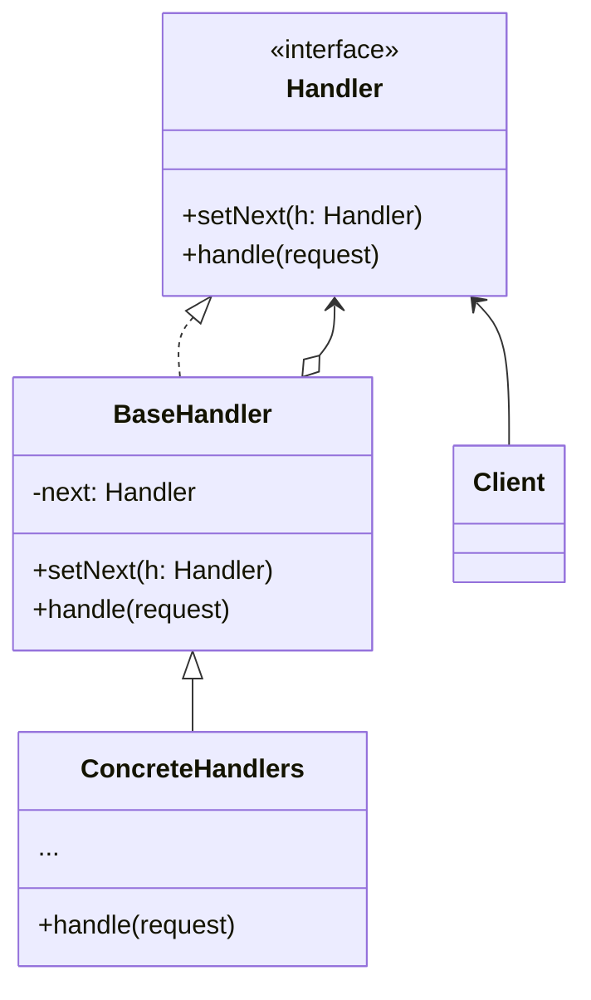

**责任链模式**是一种行为设计模式，允许你将请求沿着处理者链进行发送。收到请求后，每个处理者均可对请求进行处理，或将其传递给链上的下个处理者



<!--more-->

- **处理者（Handler）** 声明了所有具体处理者的通用接口。该接口通常仅包含单个方法用于请求处理，但有时其还会包含一个设置链上下个处理者的方法
- **基础处理者（Base Handler）** 是一个可选的类，你可以将所有处理者共用的样本代码放置在其中
- **具体处理者（Concrete Handlers）** 包含处理请求的实际代码。每个处理者接受到请求后，都必须决定是否进行处理，以及是否沿着链传递请求
 处理者通常是独立且不可变的，需要通过构造函数一次性地获得所有必要地数据
- **客户端（Client）** 可根据程序逻辑一次性或者动态地生成链。
  值得注意的是，请求可以发送给链上的任意一个处理者，而非必须是第一个处理者

## 代码示例

```typescript
// Handler interface
interface Handler {
  setNext(handler: Handler): void;
  handle(request: string): void;
}

// Abstract base handler
abstract class AbstractHandler implements Handler {
  private nextHandler: Handler;

  public setNext(handler: Handler): void {
    this.nextHandler = handler;
  }

  public handle(request: string): void {
    if (this.nextHandler) {
      this.nextHandler.handle(request);
    }
  }
}

// Concrete handlers
class ConcreteHandlerA extends AbstractHandler {
  public handle(request: string): void {
    if (request === 'A') {
      console.log("ConcreteHandlerA: Handling the request");
    } else {
      super.handle(request);
    }
  }
}

class ConcreteHandlerB extends AbstractHandler {
  public handle(request: string): void {
    if (request === 'B') {
      console.log("ConcreteHandlerB: Handling the request");
    } else {
      super.handle(request);
    }
  }
}

class ConcreteHandlerC extends AbstractHandler {
  public handle(request: string): void {
    if (request === 'C') {
      console.log("ConcreteHandlerC: Handling the request");
    } else {
      super.handle(request);
    }
  }
}

// Usage example
const handlerA = new ConcreteHandlerA();
const handlerB = new ConcreteHandlerB();
const handlerC = new ConcreteHandlerC();

handlerA.setNext(handlerB);
handlerB.setNext(handlerC);

handlerA.handle('B');
```

## 适用场景

- 当程序需要使用不同方式处理不同种类请求，而且请求类型和顺序预先未知时，可以使用责任链模式
- 当必须按顺序执行多个处理者时，可以使用该模式
- 如果所需处理者及其顺序必须在运行时进行改变，可以使用责任链模式

## 优点

- 可以控制请求处理的顺序
- 单一职责原则。可对发起操作和执行操作的类进行解耦
- 开闭原则。可以在不更改现有代码的情况下再程序中新增处理者

## 缺点

- 部分请求可能未被处理

## 与其他模式的关系

责任链模式和装饰模式的类结构非常相似。两者都依赖递归组合将需要执行的操作传递给一系列对象。

但是，责任链的管理者可以相互独立地执行一切操作，还可以随时停止传递请求。另一方面，各种装饰可以在遵循基本接口的情况下扩展对象的行为。此外装饰无法中断请求的传递

## 参考

[Refactoringguru.cn 责任链模式](https://refactoringguru.cn/design-patterns/chain-of-responsibility)
