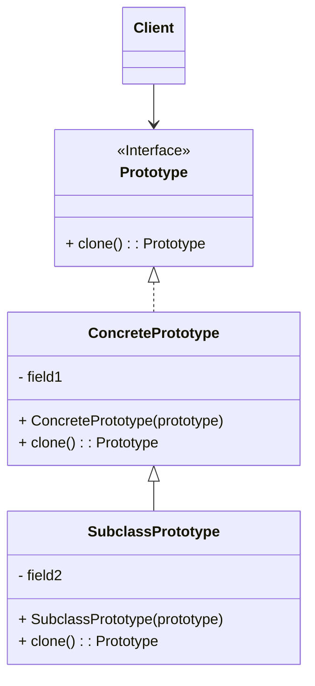
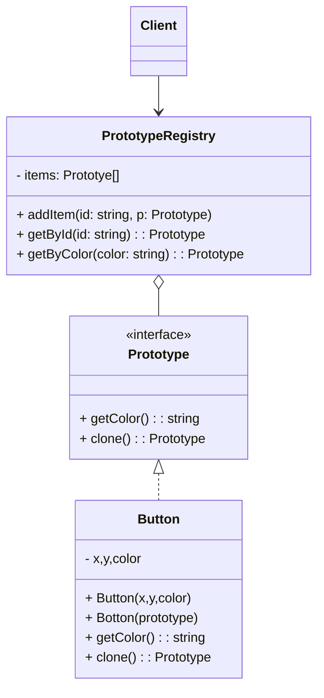

原型模式将克隆过程委派给被克隆的实际对象。模式为所有支持克隆的对象声明了一个通用接口，该接口让你能够克隆对象，同时又无需将代码和对象所属类耦合。

通常情况下，这样的接口中仅包含一个  方法

所有的类对  方法都非常相似。该方法会创建一个当前类的对象，然后将原始对象所有的成员变量值复制到新建的类中。

支持克隆的对象即为原型。当你的对象有几十个成员变量和几百种类型时，对其进行克隆甚至可以代替子类的构造

<!--more-->

## 基本实现




- **原型（Prototype）** 接口将对克隆方法进行声明
- **具体原型（Concrete Prototype）** 类将实现克隆方法。除了将原始对象的数据复制到克隆体中之外，该方法有时还需处理克隆过程中的极端情况，例如克隆关联对象和梳理递归依赖等
- **客户端（Client）** 可以复制实现了原型接口的任何对象

## 原型注册表实现



- **原型注册表（Prototype registry）** 提供了一种访问常用原型的简单方法，其中存储了一系列可供随时复制的预生成对象。

## 代码示例

```typescript
// 基础原型
abstract class Shape {
  private id: number;
  private type: string;
  protected color: string;
  protected size: number;

  constructor(id: number, type: string, color: string, size: number) {
    this.id = id;
    this.type = type;
    this.color = color;
    this.size = size;
  }

  abstract draw(): void;

  clone(prototype: Shape = this): Shape {
    const clone = Object.create(prototype)
    clone.id = crypto.randomUUID()
    clone.type = prototype.getType()
    clone.setColor(prototype.getColor())
    clone.setSize(prototype.getSize())
    return clone
  }

  getId(): number {
    return this.id;
  }

  getType(): string {
    return this.type;
  }

  getColor(): string {
    return this.color;
  }

  getSize(): number {
    return this.size;
  }

  setColor(color: string): void {
    this.color = color;
  }

  setSize(size: number): void {
    this.size = size;
  }
}

// 具体原型
class Circle extends Shape {
  radius: number
  constructor(id: number, color: string, radius: number) {
    super(id, "Circle", color, 2 * radius);
    this.radius = radius
  }

  /**
   * 需要调用父类克隆函数来复制父类中定义的私有成员变量
   * 当然由于父类定义了`Get`函数，直接在子类 Circle 克隆也是可以的
   */
  clone(prototype: Circle = this): Circle {
    const clone = super.clone(prototype) as Circle
    clone.radius = prototype.radius
    return clone
  }

  getRadius() {
    return this.radius
  }

  draw(): void {
    console.log(`Drawing a ${this.getColor()} circle with size ${this.getSize()} and ID ${this.getId()}`);
  }
}

class Rectangle extends Shape {
  rx: number
  ry: number
  constructor(id: number, color: string, size: number, rx = 0, ry = 0) {
    super(id, "Rectangle", color, size);
    this.rx = rx
    this.ry = ry
  }

  clone(prototype = this): Rectangle {
    const clone = super.clone(prototype) as Rectangle
    clone.rx = prototype.rx
    clone.ry = prototype.ry

    return clone
  }

  draw(): void {
    console.log(`Drawing a ${this.getColor()} rectangle with size ${this.getSize()} and ID ${this.getId()}`);
  }
}

// 原型注册表
class ShapeCache {
  private static shapeMap: { [id: string]: Shape } = {};

  static getShape(id: string): Shape {
    const cachedShape = ShapeCache.shapeMap[id];
    return cachedShape.clone();
  }

   // 预生成对象
  static loadCache(): void {
    const circle = new Circle(1, "Red", 10);
    const rectangle = new Rectangle(2, "Blue", 20);
    ShapeCache.shapeMap[String(circle.getId())] = circle;
    ShapeCache.shapeMap[String(rectangle.getId())] = rectangle;
  }
}

// Example usage:
ShapeCache.loadCache();

const circle1 = ShapeCache.getShape("1");
const rectangle1 = ShapeCache.getShape("2");

circle1.draw(); // Drawing a Red circle with size 10 and ID randomUUID1
rectangle1.draw(); // Drawing a Blue rectangle with size 20 and ID randomUUID2

circle1.setColor("Green");
circle1.setSize(15);

const circle2 = ShapeCache.getShape("1");
circle2.draw(); // Drawing a Red circle with size 10 and ID <different random number>
```

## 适用场景

- 需要复制一些对象，同时又希望代码独立于这些对象所属的具体类，可以使用原型模式
- 如果子类的区别仅在于其对象的初始化方式，那么可以使用该模式来减少子类的数量。别人创建这些子类的目的可能是为了创建特定类型的对象

## 优点

- 可以克隆对象，而无需与它们所属的具体类相耦合
- 可以克隆预生成原型，避免反复初始化代码
- 可以更方便地生成复杂对象
- 可以用继承以外的方式来处理复杂对象的不同配置

## 缺点

- 克隆包含循环引用的复杂对象可能会非常麻烦

## 参考

[Refactoringguru.cn 原型模式](https://refactoringguru.cn/design-patterns/prototype)
