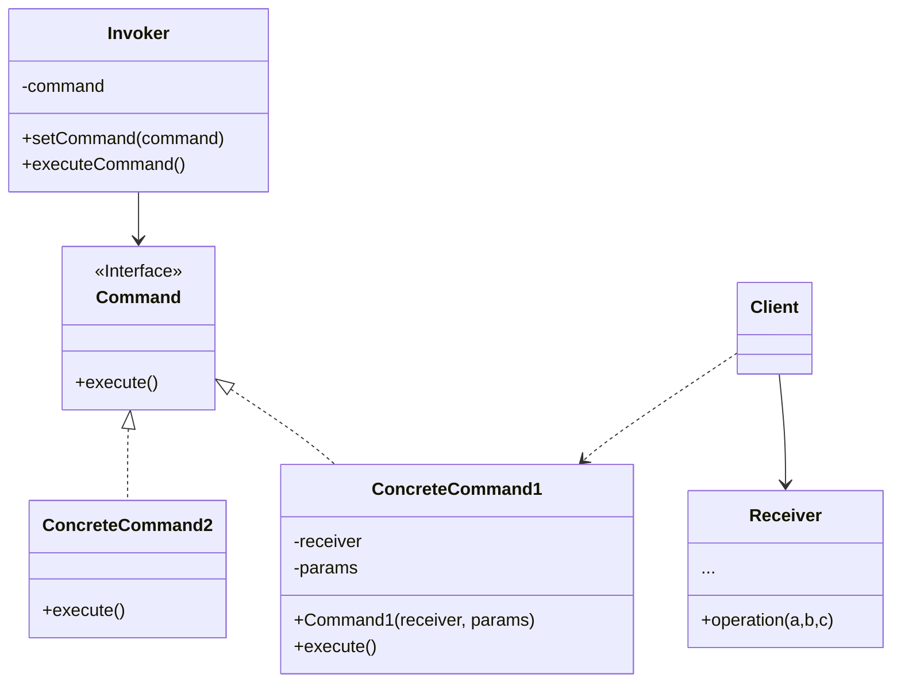

**命令模式** 是一种行为设计模式，它可将请求转换为一个包含与请求相关的所有信息的独立对象。该转换让你能根据不同的请求将方法参数化、延迟请求执行或将其放入队列中，且能实现可撤销操作



<!--more-->

- **发送者(Sender)/触发者(Invoker)** 类负责对请求进行初始化，其中必须包含一个成员变量来存储对于命令对象的引用。发送者触发命令，而不向接受者直接发送请求。注意：发送者并不负责创建命令对象：它通常会通过构造函数从客户端处获得预先生成的命令
- **命令(Command)** 接口通常仅声明一个执行命令的方法
- **具体命令(Concrete Commands)** 会实现各种类型的请求。具体命令自身并不完成工作，而是会将调用委派给一个业务逻辑对象。但为了简化代码，这些类可以进行合并。接收对象执行方法所需的参数可以声明为具体命令的成员变量，你可以将命令对象设为不可变，仅允许通过构造函数对这些成员变量进行初始化
- **接收者(Receiver)** 类包含部分业务逻辑。几乎任何对象都可以作为接受者。绝大部分命令只处理如何将请求传递到接收者的细节，接受者自己会完成实际的工作
- **客户端(Client)** 会创建并配置具体命令对象。客户端必须将包括接受者实体在内的所有请求参数传递给命令的构造函数。此后，生成的命令就可以与一个或多个发送者相关联了

## 代码实现

```ts
// Receiver class
class Light {
  turnOn(): void {
    console.log('Light is on');
  }

  turnOff(): void {
    console.log('Light is off');
  }
}

// Command interface
interface Command {
  execute(): void;
  undo(): void;
}

// Concrete command classes
class TurnOnCommand implements Command {
  private light: Light;

  constructor(light: Light) {
    this.light = light;
  }

  execute(): void {
    this.light.turnOn();
  }

  undo(): void {
    this.light.turnOff();
  }
}

class TurnOffCommand implements Command {
  private light: Light;

  constructor(light: Light) {
    this.light = light;
  }

  execute(): void {
    this.light.turnOff();
  }

  undo(): void {
    this.light.turnOn();
  }
}

// Invoker class
class RemoteControl {
  private commands: Command[] = [];

  executeCommand(command: Command): void {
    this.commands.push(command);
    command.execute();
  }

  undoLastCommand(): void {
    const lastCommand = this.commands.pop();
    if (lastCommand) {
      lastCommand.undo();
    }
  }
}

// Usage example
const light = new Light();
const turnOnCommand = new TurnOnCommand(light);
const turnOffCommand = new TurnOffCommand(light);

const remoteControl = new RemoteControl();
remoteControl.executeCommand(turnOnCommand); // Output: Light is on

// Perform additional operations, state changes, etc.

remoteControl.undoLastCommand(); // Output: Light is off
```

## 适用场景

- 如果需要通过操作来参数化对象，可使用命令模式
- 如果你想要将操作放入队列中，延迟操作的执行或者远程执行操作，可使用命令模式
- 如果你想要实现操作回滚功能，可使用命令模式

## 优点

- 单一职责原则。可以解耦触发和执行操作的类
- 开闭原则。可以在不修改已有客户端代码的情况下在程序中创建新的命令
- 可以实现撤销和恢复功能
- 可以实现操作的延迟执行
- 可以将一组简单命令组合成一个复杂命令

## 缺点

- 代码可能会变得更加复杂，因为你在发送者和接收者之间增加了一个全新的层次

## 参考

[Refactoringguru.cn 命令模式](https://refactoringguru.cn/design-patterns/command)
