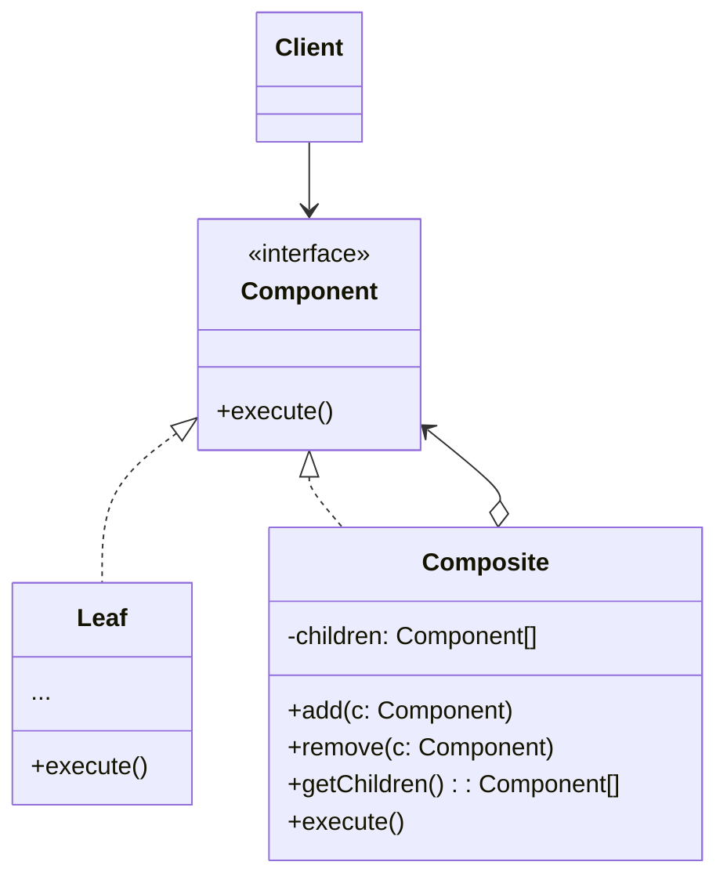

**组合模式** 是一种结构型设计模式，你可以使用它将对象组合成树状结构，并且能像使用独立对象一样使用它们。





如果应用的核心模型能用树状结构表示，在应用中使用组合模式才有价值



<!--more-->

- **组件（Component）** 接口描述了树中简单项目和复杂项目所共有的操作

- **叶节点（Leaf）** 是树的基本结构，它不包含子项目。

  一般情况下，叶节点最终会完成大部分的实际工作，因为它们无法将工作指派给其他部分

- **容器（Container/Composite）** 是包含叶节点或其他容器等子项目的单位。容器不知道其子项目所属的具体类，它只通过通用组件接口与其子项目交互

  容器接收到请求后会将工作分配给自己的子项目，处理中间结果，然后将最终结果返回给客户端

- **客户端（Client）** 通过组件接口与所有项目交互。因此，客户端能以相同方式与树状结构中的简单或复杂项目交互

## 代码示例

```typescript
// 组件接口会声明组合中简单和复杂对象的通用操作
interface Component {
  operation(): void;
}

// 叶节点代表组合的终端对象。叶节点对象中不能包含任何子对象。
// 叶节点对象通常会完成实际的工作，组合对象则会将工作委派给自己的子部件
class Leaf implements Component {
  operation(): void {
    console.log("Leaf operation");
  }
}

// 所有组件类都可以拓展其他组件
class Bud extends Leaf {
  // 其他方法
}

// 组合类表示可能包含子项目的复杂组件。组合对象通常会将实际工作委派给子项目，然后“汇总”结果
class Composite implements Component {
  private children: Component[] = [];

  // 组合对象可在其项目列表中添加或移除其他组件（简单的或复杂的皆可）
  add(component: Component): void {
    this.children.push(component);
  }

  remove(component: Component): void {
    const index = this.children.indexOf(component);
    if (index !== -1) {
      this.children.splice(index, 1);
    }
  }

  // 组合会议特定的方式执行其主要逻辑。它会递归遍历所有子项目，并收集汇总其结果
  operation(): void {
    console.log("Composite operation");
    for (const child of this.children) {
      child.operation();
    }
  }
}

// Example usage:
const leaf1 = new Leaf();
const bud = new Bud();
const composite = new Composite();
composite.add(leaf1);
composite.add(bud);

const leaf2 = new Leaf();
const composite2 = new Composite();
composite2.add(leaf2);
composite2.add(composite);

composite2.operation();
```

## 适用场景

- 如果你需要实现树状对象结构，可以使用组合模式
- 如果你希望客户端代码以相同方式处理简单和复杂元素，可以使用该模式

## 优点

- 可以利用多态和递归机制更方便地使用复杂树结构
- 开闭原则。无需更改现有代码，你就可以在应用中添加新元素，使其成为对象树的一部分

## 缺点

- 对于功能差异较大的类，提供公共接口或许会有困难。在特定情况下，你需要过度一般化组件接口，使其变得令人难以理解

## 参考

[Refactoringguru.cn 组合模式](https://refactoringguru.cn/design-patterns/composite)
