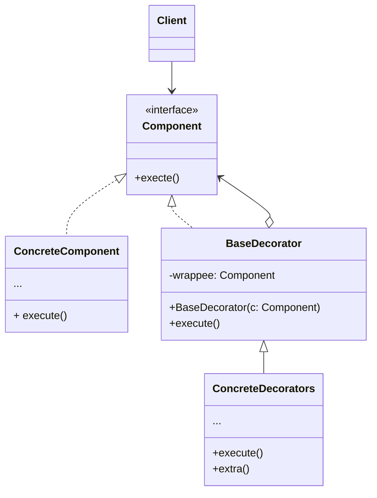

**装饰模式** 是一种结构性设计模式，允许你通过将对象放入包含行为的特殊封装对象来为原对象绑定新的行为

当你需要更改一个对象的行为时，第一个跳入脑海的想法就是拓展它所属的类。但是，你不能忽视继承可能引发的几个严重问题

- 继承是静态的。你无法在运行时更改已有对象的行为，只能使用由不同子类创建的对象来代替当前的整个对象
- 子类只能有一个父类。大部分编程语言不允许一个类同时继承多个类的行为

其中一种方法是用聚合或组合，而不是继承。两者的工作方式几乎一模一样；一个对象包含指向另一个对象的引用，并将部分工作委派给引用对象；继承中的对象则继承了父类的行为，它们自己能够完成这些工作

 是装饰模式的别称，这个称谓明确地表达了该模式的主要思想。“封装器”是一个能与其他“目标”对象连接的对象。封装器包含与目标对象相同的一系列方法，它会将所有接收到的请求委派给目标对象。但是，封装器可以在将请求委派给目标前后对其进行处理，所以可能会改变最终结果。

<!--more-->

## 装饰模式结构



- **部件（Component）** 声明封装器和被封装对象的公用接口
- **具体部件（Concrete Component）** 类是被封装对象所属的类。它定义了基础行为，但装饰类可以改变这些行为
- **基础装饰（Base decorator）** 类拥有一个可以指向被装饰对象的引用成员变量。该变量的类型应当被声明为通用部件接口，这样它就可以引用具体的部件和装饰。装饰基类会将所有操作委派给被封装的对象
- **具体装饰类（Concrete Decorators）** 定义了可动态添加到部件的额外行为。具体装饰类会重写装饰基类的方法，并在调用父类方法之前或之后进行额外的行为
- **客户端（Client）** 可以使用多层装饰来封装部件，只要它能使用通用接口与所有对象交互即可

## 代码示例

```typescript
// 装饰可以改变组件接口所定义的操作
interface Component {
  operation(): string;
}

// 具体组件提供操作的默认实现
class BasicPizza implements Component {
  public operation(): string {
    return "Pizza with tomato sauce and cheese";
  }
}

// 装饰基类和其他组件遵循相同的接口。该类的主要任务是定义所有具体装饰的封装接口
// 封装的默认实现代码中可能会包含一个被封装组件的成员变量，并且负责对其进行初始化
abstract class PizzaDecorator implements Component {
  protected component: Component;

  constructor(component: Component) {
    this.component = component;
  }

  // 具体装饰可调用其父类的操作实现，而不是直接调用被封装对象。这种方式可简化装饰类的拓展工作
  // 当然这里定义为了抽象方法, 具体装饰的不能直接调用的，只能实现 operation 方法
  public abstract operation(): string;
}

class Pepperoni extends PizzaDecorator {
  public operation(): string {
    return `${this.component.operation()}, with pepperoni`;
  }
}

class Mushrooms extends PizzaDecorator {
  public operation(): string {
    return `${this.component.operation()}, with mushrooms`;
  }
}

class Onions extends PizzaDecorator {
  public operation(): string {
    return `${this.component.operation()}, with onions`;
  }
}

// 装饰组件的简单示例
let pizza: Component = new BasicPizza();
console.log(pizza.operation());

pizza = new Pepperoni(pizza);
console.log(pizza.operation());

pizza = new Mushrooms(pizza);
console.log(pizza.operation());

pizza = new Onions(pizza);
console.log(pizza.operation());


// 客户端使用外部数据源。PizzaManager 对象不关心 Pizza 是使用什么做的。
// 它们会与提前配置好的数据源进行交互，数据源则是通过程序配置器获取的
class PizzasManager {
  private component: Component;

  constructor(component: Component) {
    this.component = component;
  }

  public addTopping(topping: PizzaDecorator): void {
    this.component = topping;
  }

  public getPizza(): string {
    return this.component.operation();
  }
}

// Usage
const manager = new PizzasManager(new BasicPizza());
console.log(manager.getPizza());

manager.addTopping(new Pepperoni(manager));
console.log(manager.getPizza());

manager.addTopping(new Mushrooms(manager));
console.log(manager.getPizza());

manager.addTopping(new Onions(manager));
console.log(manager.getPizza());
```

## 适用场景

- 如果你希望在无需修改代码的情况下即可使用对象，且希望在运行时为对象新增额外的行为，可以使用装饰模式
- 如果用继承来拓展对象行为的方案难以实现或者根本不可行，你可以使用该模式。（比如说关键字限制的类）

## 优点

- 无需创建新子类即可拓展对象的行为
- 可以在运行时添加或删除对象的功能
- 可以使用多个装饰封装对象来组合几种行为
- 单一职责原则。可以将实现了许多不同行为的一个大类拆分为多个较小的类

## 缺点

- 在封装器中删除特定封装器比较困难
- 实现行为不受装饰栈影响的装饰比较困难
- 各层的初始化配置代码看上去可能会比较糟糕

## 参考

[Refactoringguru.cn 装饰模式](https://refactoringguru.cn/design-patterns/decorator)
