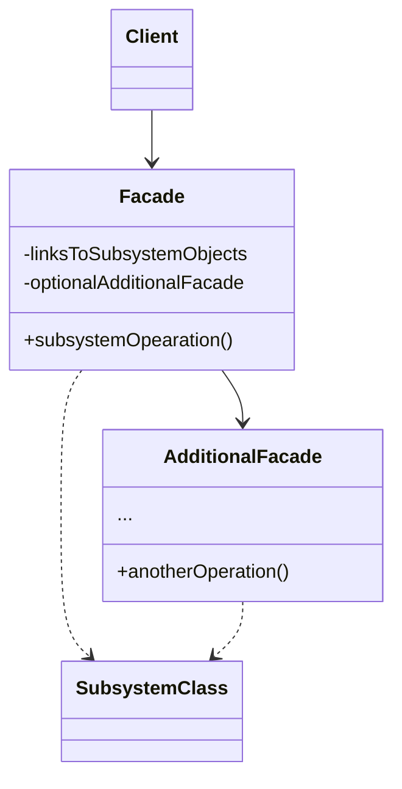

**外观模式** 是一种结构型设计模式，能为程序库、框架或其他复杂类提供一个简单的接口。

外观类为包含许多活动部件的复杂子系统提供一个简单的接口。与直接调用子系统相比，外观提供的功能可能比较有限，但它却包含了客户端真正关心的功能。

如果你的程序需要与包含几十种功能的复杂库整合，但只需使用其中非常少的功能，那么使用外观模式会非常方便

<!--more-->

## 外观模式结构



- **外观（Facade）** 提供了一种访问特定子系统功能的便捷方式，其了解如何重定向客户端请求，知晓如何操作一切活动部件
- **附加外观（Additional Facade）** 类可以避免多种不相关的功能污染单一外观，使其变成又一个复杂结构。客户端和其他外观都可以使用附加外观
- **复杂子系统（Complex Subsystem）** 由数十个不同对象构成。如果要用这些对象完成有意义的工作，你必须深入了解子系统的实现细节，比如按照正确顺序初始化对象和为其提供正确格式的数据
- **客户端（Client）** 使用外观代替对子系统对象的直接调用

## 代码示例

```typescript
class CPU {
  public freeze(): void {
    console.log("CPU: Freezing...");
  }

  public jump(position: number): void {
    console.log(`CPU: Jumping to position ${position}...`);
  }

  public execute(): void {
    console.log("CPU: Executing...");
  }
}

class Memory {
  public load(position: number, data: string): void {
    console.log(`Memory: Loading data "${data}" to position ${position}...`);
  }
}

class HardDrive {
  public read(position: number, size: number): string {
    console.log(`HardDrive: Reading ${size} bytes from position ${position}...`);
    return "Some data from the hard drive";
  }
}

// 为了将框架的复杂性隐藏在一个简单接口背后，我们创建了一个外观类。
// 它是在功能性和简洁性之间做出的权衡
class ComputerFacade {
  private cpu: CPU;
  private memory: Memory;
  private hardDrive: HardDrive;

  constructor() {
    this.cpu = new CPU();
    this.memory = new Memory();
    this.hardDrive = new HardDrive();
  }

  public start(): void {
    this.cpu.freeze();
    this.memory.load(0, "Some initial data");
    this.cpu.jump(0);
    const bootSector = this.hardDrive.read(0, 128);
    this.memory.load(0, bootSector);
    this.cpu.execute();
  }
}

// Usage
// 应用程序的类并不依赖复杂框架中成千上万的类。
// 同样，如果你决定更换框架，那只需重写外观类即可
const computerFacade = new ComputerFacade();
computerFacade.start();
```

## 适用场景

- 如果你需要一个指向复杂子系统的直接接口，且该接口的功能有限，则可以使用外观模式
- 如果需要将子系统组织为多层结构，可以使用外观

## 优点

- 可以让自己的代码独立于复杂子系统

## 缺点

- 外观可能成为与程序中所有类都耦合的**上帝对象**

## 参考

[Refactoringguru.cn 外观模式](https://refactoringguru.cn/design-patterns/facade)
