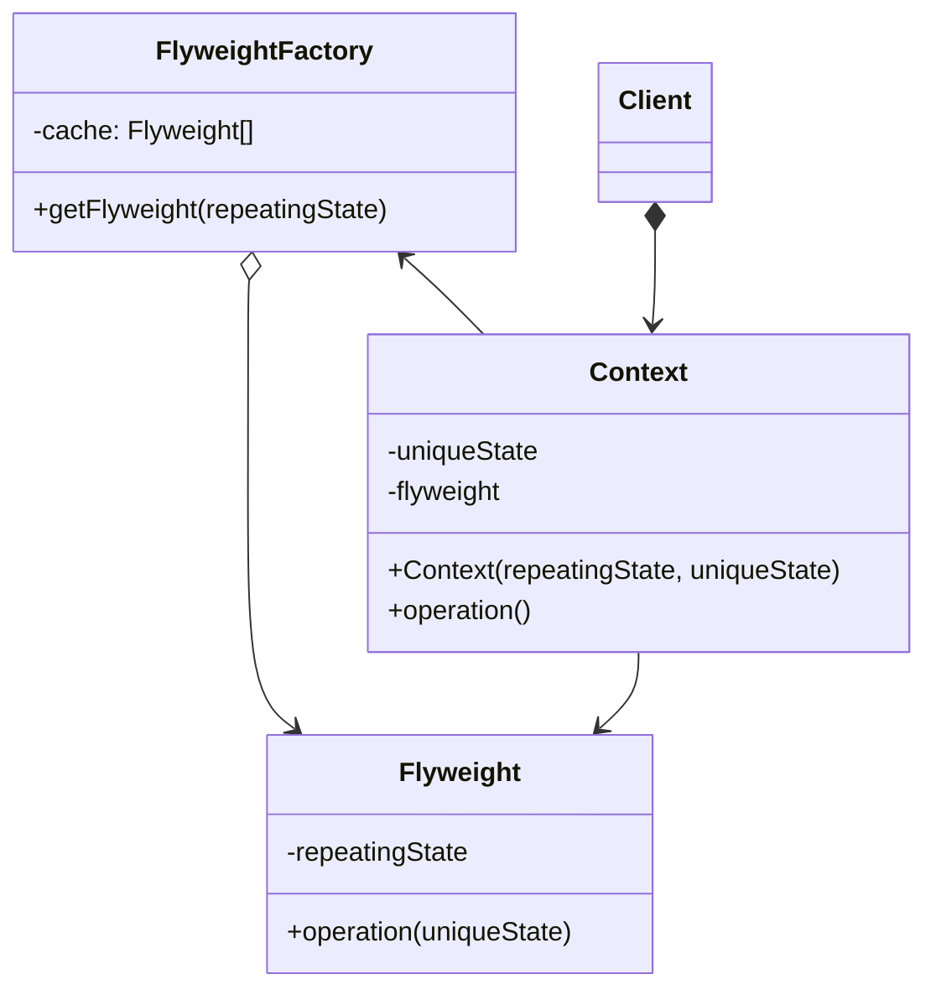

**享元模式** 是一种结构型设计模式，它摒弃了在每个对象中保存所有数据的方式，通过共享多个对象共有的相同状态，让你能在有限的内存容量中载入更多对象

## 享元模式结构





享元模式只是一种优化。在使用该模式之前，你要确定程序中存在大量类似对象同时占用内存相关的内存消耗问题，并且确保该问题无法使用其他更好的方式来解决



<!--more-->

- **享元（Flyweight）** 类包含原始对象中部分能在多个对象中共享的状态。同一享元对象可在许多不同情景中使用。享元中存储的状态被称为“内在状态”。传递给享元方法的状态被称为“外在状态”
- **情景（Context）** 类包含原始对象中各不相同的外在状态。情景和享元对象组合在一起就能表示原始对象的全部状态
- 通常情况下，原始对象的行为会保留在享元类中。因此调用享元方法必须提供部分外在状态作为参数。但你也可将行为移动到情景类中，然后将连入的享元作为单纯的数据对象
- **客户端（Client）** 负责计算或存储享元的外在状态。在客户端看来，享元是一种可在运行时进行配置的模板对象，具体的配置方式为向其方法中传入一些情景数据参数
- **享元工厂（Flyweight Factory）** 会对已有享元的缓存池进行管理。有了工厂后，客户端就无需直接创建享元，它们只需调用工厂并向其传递目标享元的一些内在状态即可。工厂会根据参照在之前已创建的享元中进行查找，如果找到满足条件的享元就将其返回；如果没有找到就根据参数创建新享元



**享元与不可变性**

由于享元对象可在不同的情景中使用，你必须确保其状态不能被修改。享元类的状态只能由构造函数的参数进行一次性的初始化，它不能对其他对象公开其设置器或公有成员变量



## 代码示例

```typescript
class Coffee {
  private flavor: string;

  constructor(flavor: string) {
    this.flavor = flavor;
  }

  public getFlavor(): string {
    return this.flavor;
  }

  public serveCoffee(context: CoffeeContext): void {
    console.log(`Serving ${this.flavor} coffee to table ${context.getTable()}...`);
  }
}

// 情景对象包含原始对象中的外在状态
class CoffeeContext {
  private tableNumber: number;

  constructor(tableNumber: number) {
    this.tableNumber = tableNumber;
  }

  public getTable(): number {
    return this.tableNumber;
  }
}

// 享元工厂决定是否复用已有享元或者创建一个新的对象
class CoffeeFactory {
  private flavors: Map<string, Coffee> = new Map<string, Coffee>();

  public getCoffeeFlavor(flavor: string): Coffee {
    if (!this.flavors.has(flavor)) {
      console.log(`Creating new ${flavor} coffee...`);
      this.flavors.set(flavor, new Coffee(flavor));
    }
    return this.flavors.get(flavor) as Coffee;
  }

  public getTotalCoffeeFlavorsMade(): number {
    return this.flavors.size;
  }
}

// Usage
const tables: CoffeeContext[] = [
  new CoffeeContext(1),
  new CoffeeContext(2),
  new CoffeeContext(3),
];

const coffeeFactory = new CoffeeFactory();

coffeeFactory.getCoffeeFlavor("Cappuccino").serveCoffee(tables[0]);
coffeeFactory.getCoffeeFlavor("Latte").serveCoffee(tables[1]);
coffeeFactory.getCoffeeFlavor("Cappuccino").serveCoffee(tables[2]);

console.log(`Total coffee flavors made: ${coffeeFactory.getTotalCoffeeFlavorsMade()}`);
```

## 适用场景

- 仅在程序必须支持大量对象且没有足够的内存容量时使用享元模式

## 优点

- 如果程序中有很多相似对象，那么你将可以节省大量内存

## 缺点

- 你可能需要牺牲执行速度来换取内存，因为他人每次调用享元方法时都需要重新计算部分场景数据
- 代码会变得更加复杂。

## 参考

[Refactoringguru.cn 享元模式](https://refactoringguru.cn/design-patterns/flyweight)
