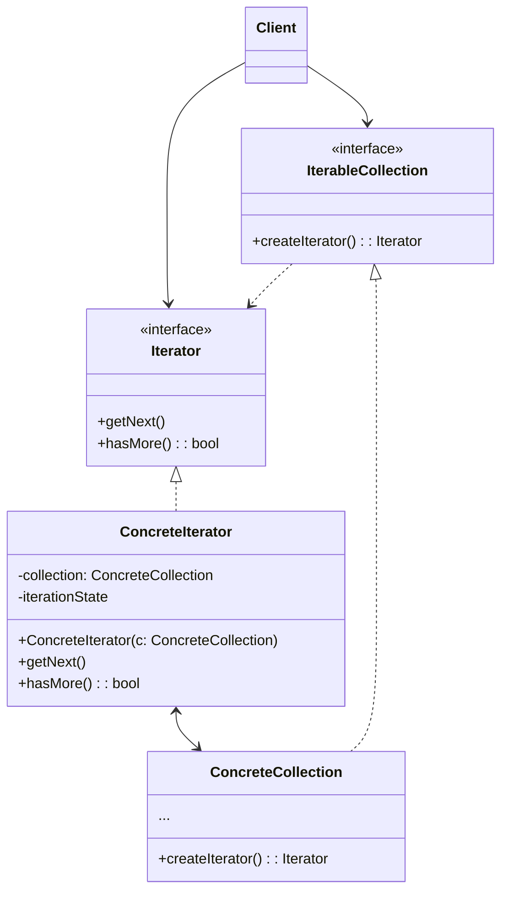

迭代器模式是一种行为设计模式，让你能在不暴露集合底层表现形式（列表，栈和树等）的情况下遍历集合中所有的元素



<!--more-->

- **迭代器（Iterator）** 接口声明了遍历几何所需的操作：获取下一个元素、获取当前位置和重新开始迭代等
- **具体迭代器（Concrete Iterator）** 实现遍历集合的一种特定算法。迭代器对象必须跟踪自身遍历的进度。这使得多个迭代器可以相互独立地遍历同一集合
- **集合（collection）** 接口声明了一个或多个方法来获取与集合兼容的迭代器。请注意，返回方法的类型必须被声明为迭代器接口，因此具体几何可以返回各种不同类型的迭代器
- **具体集合（Concrete Collections）** 会在客户端请求迭代器时返回一个特定的具体迭代器类实体（图中隐藏了集合的其他代码）。
- **客户端（Client）** 通过集合和迭代器的接口与两者进行交互。这样依赖客户端无需与具体类进行耦合，允许同一客户端代码使用各种不同的集合和迭代器

## 代码实现

```ts
interface Iterator<T> {
  hasNext(): boolean;
  next(): T;
}

interface Aggregate<T> {
  createIterator(): Iterator<T>;
}

class ConcreteIterator<T> implements Iterator<T> {
  private collection: T[];
  private position: number;

  constructor(collection: T[]) {
    this.collection = collection;
    this.position = 0;
  }

  hasNext(): boolean {
    return this.position < this.collection.length;
  }

  next(): T {
    if (!this.hasNext()) {
      throw new Error('End of collection reached.');
    }

    const element = this.collection[this.position];
    this.position++;
    return element;
  }
}

class ConcreteAggregate<T> implements Aggregate<T> {
  private collection: T[];

  constructor() {
    this.collection = [];
  }

  addItem(item: T): void {
    this.collection.push(item);
  }

  createIterator(): Iterator<T> {
    return new ConcreteIterator(this.collection);
  }
}

// Usage Example
const aggregate = new ConcreteAggregate<number>();
aggregate.addItem(1);
aggregate.addItem(2);
aggregate.addItem(3);

const iterator = aggregate.createIterator();

while (iterator.hasNext()) {
  const item = iterator.next();
  console.log(item);
}
```

## 适用场景

- 当集合背后为复杂的数据结构，且你希望对客户端隐藏其复杂性时（出于使用便利性或安全性的考虑），可以使用迭代器模式
- 使用该模式可以减少程序中重复的遍历代码
- 如果你希望代码能够遍历不同的甚至是无法预知的数据结构，可以使用迭代器模式

## 优点

- 单一职责原则。通过将体积庞大的遍历算法代码抽取为独立的类，你可对客户端代码和集合进行整理
- 开闭原则。可实现新型的集合和迭代器并将其传递给现有代码，无需修改现有代码
- 可以并行遍历同一集合，因为每个迭代器对象都包含其自身的遍历状态
- 可以暂停遍历并在需要时继续

## 缺点

- 如果你的程序只与简单的集合进行交互，应用该模式可能会矫枉过正
- 对于某些特殊几何，使用迭代器可能比直接遍历的效率低

## 参考

[Refactoringguru.cn 迭代器模式](https://refactoringguru.cn/design-patterns/iterator)
