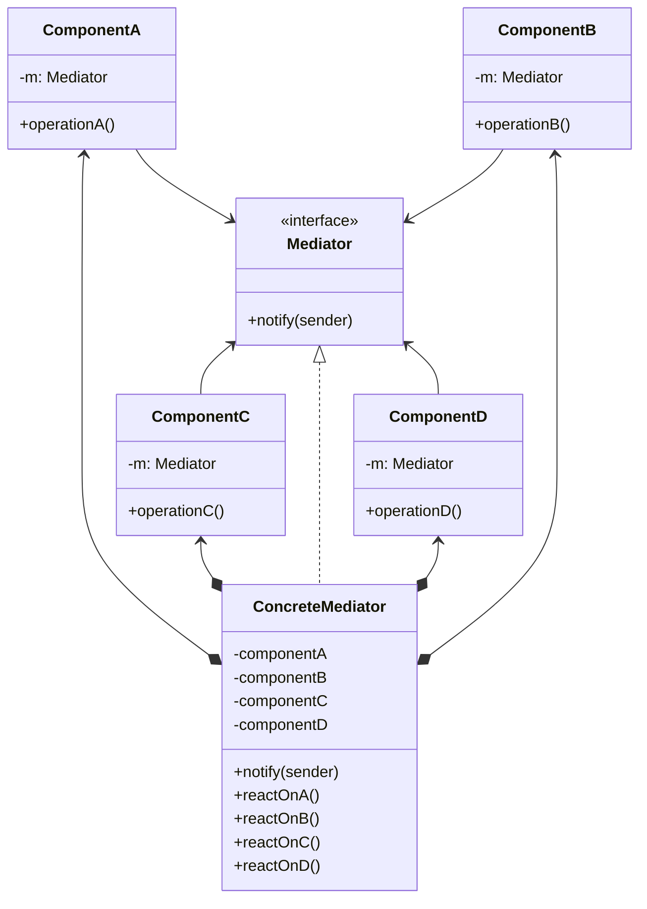

**中介者模式** 是一种行为设计模式，能让你减少对象之间混乱无序的依赖关系。该模式会限制对象之间的直接交互，迫使它们通过一个中介者对象进行合作



<!--more-->

- **组件（Component）** 是各种包含业务逻辑的类。每个组件都有一个指向中介者的引用，该引用被声明为中介者接口类型。组件不知道中介者实际所属的类，因此你可通过将其连接到不同的中介者以使其能在其他程序中复用
- **中介者（Mediator）** 接口声明了与组件交流的方法，但通常仅包括一个通知方法。组件可将任意上下文（包括自己的对象）作为该方法的参数，只有这样接收组件和发送者类之间才不会耦合
- **具体中介者（Concrete Mediator）** 封装了多种组件间的关系。具体中介者通常会保存所有组件的引用并对其进行管理，甚至有时会对其生命周期进行管理
- 组件并不知道其他组件的情况。如果组件内发生了重要事件，它只能通知中介者。中介者收到通知后能轻易地确定发送者，者或许已足以判断接下来需要触发的组件了。

## 代码实现

```ts
// Mediator Interface
interface Mediator {
  notify(sender: Colleague, event: string): void;
}

// Colleague Base Class
abstract class Colleague {
  protected mediator: Mediator;

  constructor(mediator: Mediator) {
    this.mediator = mediator;
  }

  send(event: string): void {
    this.mediator.notify(this, event);
  }

  abstract receive(event: string): void;
}

// Concrete Colleague Classes
class ConcreteColleague1 extends Colleague {
  receive(event: string): void {
    console.log(`ConcreteColleague1 received event: ${event}`);
  }
}

class ConcreteColleague2 extends Colleague {
  receive(event: string): void {
    console.log(`ConcreteColleague2 received event: ${event}`);
  }
}

// Concrete Mediator Class
class ConcreteMediator implements Mediator {
  private colleague1: ConcreteColleague1;
  private colleague2: ConcreteColleague2;

  setColleague1(colleague1: ConcreteColleague1): void {
    this.colleague1 = colleague1;
  }

  setColleague2(colleague2: ConcreteColleague2): void {
    this.colleague2 = colleague2;
  }

  notify(sender: Colleague, event: string): void {
    if (sender === this.colleague1) {
      this.colleague2.receive(event);
    } else if (sender === this.colleague2) {
      this.colleague1.receive(event);
    }
  }
}

// Usage
const mediator = new ConcreteMediator();

const colleague1 = new ConcreteColleague1(mediator);
const colleague2 = new ConcreteColleague2(mediator);

mediator.setColleague1(colleague1);
mediator.setColleague2(colleague2);

colleague1.send('Event 1');
colleague2.send('Event 2');
```

## 适用场景

- 当一些对象和其他对象紧密耦合以致难以对其进行修改时，可使用中介者模式
- 当组件过于依赖其他组件而无法在不同应用中复用时，可使用中介者模式
- 如果为了能在不同情景下复用一些基本行为，导致你需要被迫创建大量组件子类时，可使用中介者模式

## 优点

- 单一职责原则。你可以将多个组件间的交流抽取到同一位置，使其更易于理解和维护
- 开闭原则。你无需修改实际组件就能增加新的中介者
- 你可以减轻应用中多个组件的耦合情况
- 你可以更方便地复用各个组件

## 缺点

- 一段时间后，中介者可能会演化成为上帝对象

## 参考

[Refactoringguru.cn 中介者模式](https://refactoringguru.cn/design-patterns/mediator)
