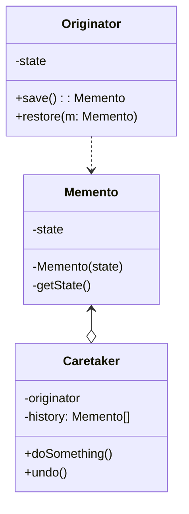
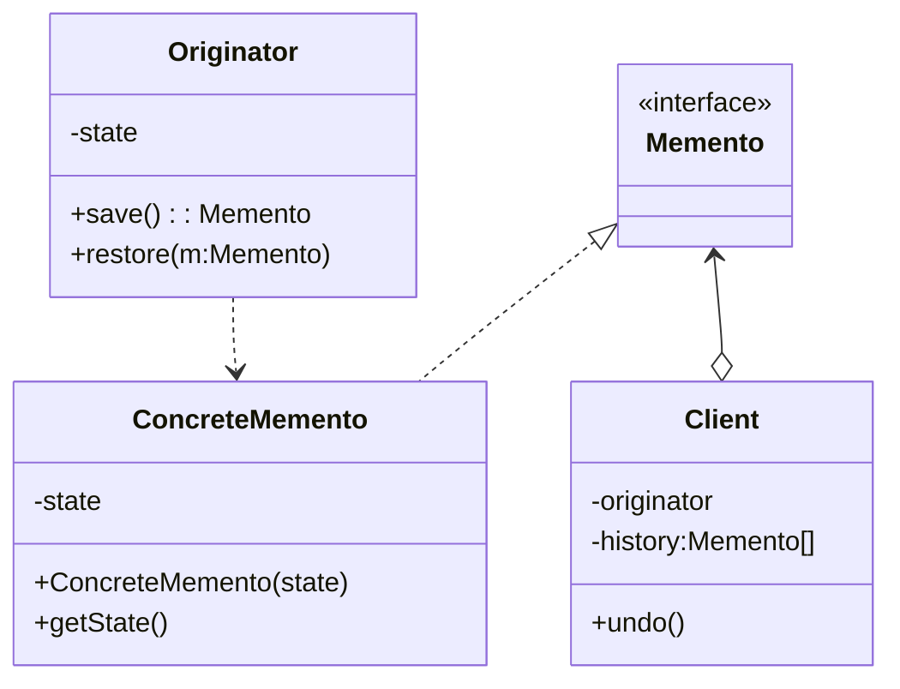
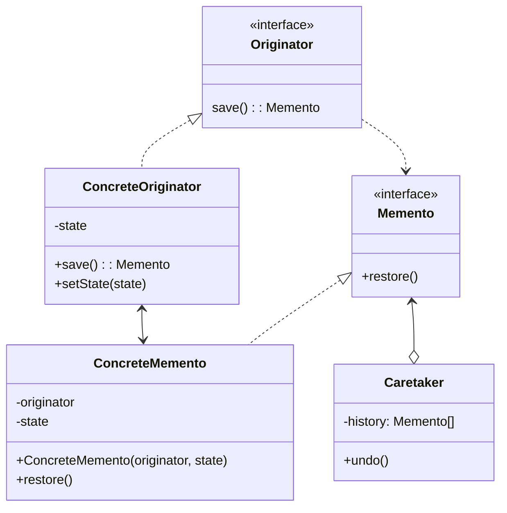

**备忘录模式** 是一种行为设计模式，允许在不暴露对象细节的情况下保存和恢复对象之前的状态

## 基于嵌套类实现



<!--more-->

- **原发器（Originator）** 类可以生成自身状态的快照，也可以在需要时通过快照恢复自身状态
- **备忘录（Memento）** 是原发器状态快照的值对象（value Object）。通常做法是将备忘录设为不可变，并通过构造函数一次性传递数据
- **负责人（Caretaker）** 仅知道“何时”和“为何”捕捉原发器的状态，以及何时恢复状态
- 在该实现方法中，备忘录类将被嵌套在原发器中。这样原发器就可访问备忘录的成员变量和方法，即使这些方法被声明为私有。另一方面，负责人对于备忘录的成员变量和方法的访问权限非常有限：它们只能在栈中保存备忘录，而不能修改其状态。

### Typescript中的嵌套类

在Typescript中，没有直接支持嵌套类的语法。嵌套类指的是在一个类内部定义另一个类。然而，可以通过其他方式实现类似的效果

一种常见的方法是使用内部类（inner classes），即在外部类的成员中定义一个独立的类。这个内部类可以访问外部类的成员和方法，但在外部类之外是不可见的。

```ts
class OuterClass {
  outerProperty: string;

  constructor(outerProperty: string) {
    this.outerProperty = outerProperty;
  }

  outerMethod(): void {
    console.log('Outer method');
  }

  innerClass: InnerClass = new InnerClass();

  // Inner class
  class InnerClass {
    innerProperty: number;

    constructor() {
      this.innerProperty = 42;
    }

    innerMethod(): void {
      console.log('Inner method');
      console.log('Accessing outer property:', outerProperty); // Access outer property
      outerMethod(); // Access outer method
    }
  }
}

// Usage
const outerObj = new OuterClass('Hello');
outerObj.innerClass.innerMethod();
```

## 基于中间接口的实现



- 在没有嵌套类的情况下，你可以规定负责人仅可通过声明的中间接口与备忘录互动，该接口仅声明与备忘录元数据相关的方法，限制其对备忘录成员变量的直接访问权限
- 另一方面，原发器可以直接与备忘录对象进行交互，访问备忘录类中声明的成员变量和方法。这种方式的确定在于你需要将备忘录的所有成员变量声明为公有

## 封装更加严格的实现

如果你不想让其他类有任何机会通过备忘录来访问原发器的状态，那么还有另一种可用的实现方式



- 这种实现方式允许存在多种不同类型的原发器和备忘录。每种原发器都和其相应的备忘录进行交互。原发器和备忘录都不会将其状态暴露给其他类
- 负责人此时被明确禁止修改存储在备忘录中的状态。但负责人将独立于原发器，因为此时恢复方法被定义在备忘录类中
- 每个备忘录将于创建了自身的原发器连接。原发器会将自己及状态传递给备忘录的构造函数。由于这些类之间的紧密联系，只要原发器定义了合适的设置器（setter），备忘录就能恢复其状态

## 代码实现（基于中间接口）

```ts
// Originator class
class Originator {
  private state: string;

  setState(state: string): void {
    console.log(`Setting state to: ${state}`);
    this.state = state;
  }

  saveToMemento(): Memento {
    console.log("Saving state to memento");
    return new Memento(this.state);
  }

  restoreFromMemento(memento: Memento): void {
    console.log("Restoring state from memento");
    this.state = memento.getState();
  }

  showState(): void {
    console.log(`Current state: ${this.state}`);
  }
}

// Memento class
class Memento {
  private state: string;

  constructor(state: string) {
    this.state = state;
  }

  getState(): string {
    return this.state;
  }
}

// Caretaker class
class Caretaker {
  private mementos: Memento[] = [];

  addMemento(memento: Memento): void {
    this.mementos.push(memento);
  }

  getMemento(index: number): Memento {
    return this.mementos[index];
  }
}

// Usage
const originator = new Originator();
const caretaker = new Caretaker();

originator.setState("State 1");
caretaker.addMemento(originator.saveToMemento());

originator.setState("State 2");
caretaker.addMemento(originator.saveToMemento());

originator.setState("State 3");
originator.showState();

originator.restoreFromMemento(caretaker.getMemento(1));
originator.showState();
```

## 适用场景

- 当你需要创建对象状态快照来恢复其之前的状态时，可以使用备忘录模式
- 当直接访问对象的成员变量，获取器或设置器将导致封装被突破时，可以使用该模式

## 优点

- 可以在不破坏对象封装情况的前提下创建对象状态快照
- 可以通过让负责人维护原发器状态历史记录来简化原发器代码

## 缺点

- 如果客户端过于频繁地创建备忘录，程序将消耗大量内存
- 负责人必须完整跟踪原发器的生命周期，这样才能销毁弃用的备忘录
- 绝大部分动态编程语言（例如PHP、Python和Javascript）不能确保备忘录中的状态不被修改

## 参考

[Refactoringguru.cn 备忘录模式](https://refactoringguru.cn/design-patterns/memento)
