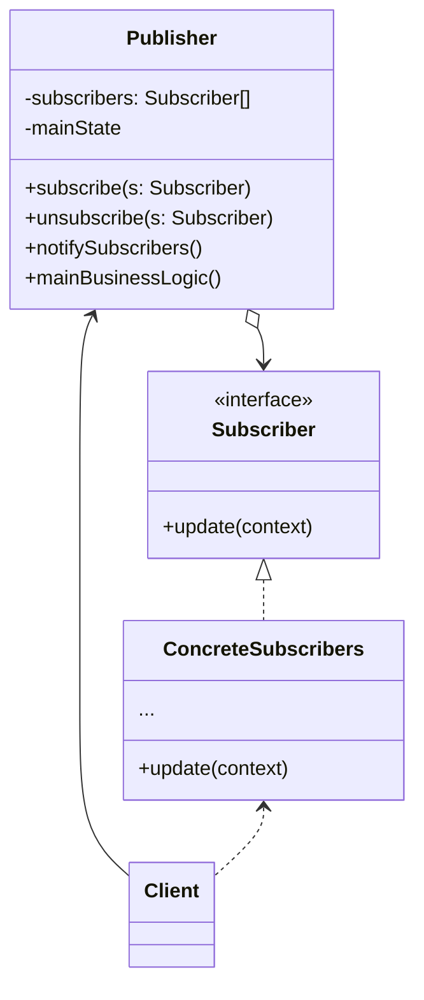

**观察者模式**是一种行为设计模式，允许你定义一种订阅机制，可在对象事件发生时通知多个“观察”该对象的其他对象



<!--more-->

- **发布者（Publisher）** 会向其他对象发送值得关注的事件。事件会在发布者自身状态改变或执行特定行为后发生。发布者中包含一个允许新订阅者加入和当前订阅者离开列表的订阅架构
- 当新事件发生时，发送者会遍历订阅列表并调用每个订阅者对象的通知方法。该方法是在订阅者接口中声明的
- **订阅者（Subscriber）** 接口声明了通知接口。在绝大多数情况下，该接口仅包含一个update方法。该方法可以拥有多个参数，使发布者能在更新时传递事件的详细信息
- **具体订阅者（Concrete Subscriber）** 可以执行一些操作来回应发布者的通知。所有具体订阅者类都实现了同样的接口，因此发布者不需要与具体类相耦合
- 订阅者通常需要一些上下文信息来正确地处理更新。因此，发布者通常会将一些上下文数据作为通知方法的参数进行传递。发布者也可将自身作为参数进行传递，使订阅者直接获取所需的数据
- **客户端（Client）** 会分别创建发布者和订阅者对象，然后为订阅者注册发布者更新

## 代码实现

```typescript
interface Observer {
  update(data: any): void;
}

class Subscriber implements Observer {
  private name: string;

  constructor(name: string) {
    this.name = name;
  }

  update(data: any): void {
    console.log(`${this.name} received data: ${data}`);
  }
}

interface Publisher {
  subscribe(subscriber: Observer): void;
  unsubscribe(subscriber: Observer): void;
  notify(data: any): void;
}

class NewsPublisher implements Publisher {
  private subscribers: Observer[] = [];

  subscribe(subscriber: Observer): void {
    this.subscribers.push(subscriber);
  }

  unsubscribe(subscriber: Observer): void {
    const index = this.subscribers.indexOf(subscriber);
    if (index !== -1) {
      this.subscribers.splice(index, 1);
    }
  }

  notify(data: any): void {
    console.log(`NewsPublisher is notifying subscribers...`);
    for (const subscriber of this.subscribers) {
      subscriber.update(data);
    }
  }

  publishNews(news: string): void {
    console.log(`Publishing news: ${news}`);
    this.notify(news);
  }
}

class WeatherPublisher implements Publisher {
  private subscribers: Observer[] = [];

  subscribe(subscriber: Observer): void {
    this.subscribers.push(subscriber);
  }

  unsubscribe(subscriber: Observer): void {
    const index = this.subscribers.indexOf(subscriber);
    if (index !== -1) {
      this.subscribers.splice(index, 1);
    }
  }

  notify(data: any): void {
    console.log(`WeatherPublisher is notifying subscribers...`);
    for (const subscriber of this.subscribers) {
      subscriber.update(data);
    }
  }

  publishWeather(weather: string): void {
    console.log(`Publishing weather: ${weather}`);
    this.notify(weather);
  }
}

// Usage example
const newsPublisher = new NewsPublisher();
const weatherPublisher = new WeatherPublisher();

const subscriber1 = new Subscriber("Subscriber 1");
const subscriber2 = new Subscriber("Subscriber 2");

newsPublisher.subscribe(subscriber1);
newsPublisher.subscribe(subscriber2);

weatherPublisher.subscribe(subscriber2);

newsPublisher.publishNews("New article published!");
weatherPublisher.publishWeather("Sunny day ahead!");

newsPublisher.unsubscribe(subscriber1);
weatherPublisher.unsubscribe(subscriber2);

newsPublisher.publishNews("Breaking news!");
weatherPublisher.publishWeather("Rainy weather expected.");

/**
[LOG]: "Publishing news: New article published!" 
[LOG]: "NewsPublisher is notifying subscribers..." 
[LOG]: "Subscriber 1 received data: New article published!" 
[LOG]: "Subscriber 2 received data: New article published!" 
[LOG]: "Publishing weather: Sunny day ahead!" 
[LOG]: "WeatherPublisher is notifying subscribers..." 
[LOG]: "Subscriber 2 received data: Sunny day ahead!" 
[LOG]: "Publishing news: Breaking news!" 
[LOG]: "NewsPublisher is notifying subscribers..." 
[LOG]: "Subscriber 2 received data: Breaking news!" 
[LOG]: "Publishing weather: Rainy weather expected." 
[LOG]: "WeatherPublisher is notifying subscribers..." 
 */
```

## 适用场景

- 当一个对象状态的改变需要改变其他对象，或实际对象是事先未知的或动态变化的时，可使用观察者模式
- 当应用中的一些对象必须观察其他对象时，可使用该模式。但仅能在有限时间内或特定情况下使用

## 优点

- 开闭原则。你无需修改发布者代码就能引入新的订阅者类（如果是发布者接口则可轻松引入发布者类）
- 你可以在运行时建立对象之间的联系

## 缺点

- 订阅者的通知顺序是随机的

## 参考

[Refactoringguru.cn 观察者模式](https://refactoringguru.cn/design-patterns/observer)
