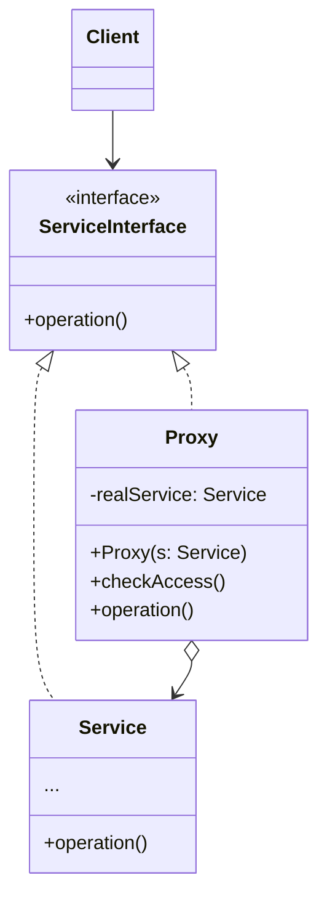

**代理模式** 是一种结构型设计模式，让你能够提供对象的替代品或其占位符。代理空着着对于原对象的访问，并允许在将请求提交给对象前后进行一些处理。

## 代理模式结构



<!--more-->

- **服务接口（Service Interface）** 声明了服务接口。代理必须遵循该接口才能伪装成服务对象
- **服务（Service）** 类提供了一些实用的业务逻辑
- **代理（Proxy）** 类包含一个指向服务对象的引用成员变量。代理完成其任务（例如延迟初始化、记录日志、访问控制和缓存等）后会将请求传递给服务对象
  通常情况下，代理会对其服务对象的整个生命周期进行管理
- **客户端（Client）** 能通过同一接口与服务或代理进行交互，所以你可在一切需要服务对象的代码中使用代理

## 代码实现

```typescript
interface Image {
  display(): void;
}

class RealImage implements Image {
  private fileName: string;

  constructor(fileName: string) {
    this.fileName = fileName;
    this.loadFromDisk();
  }

  public display(): void {
    console.log(`Displaying ${this.fileName}`);
  }

  private loadFromDisk(): void {
    console.log(`Loading ${this.fileName} from disk`);
  }
}

class ImageProxy implements Image {
  private realImage: RealImage | undefined;
  private fileName: string;

  constructor(fileName: string) {
    this.fileName = fileName;
  }

  public display(): void {
    if (!this.realImage) {
      this.realImage = new RealImage(this.fileName);
    }
    this.realImage.display();
  }
}

// Usage
const image1 = new ImageProxy("image1.jpg");
const image2 = new ImageProxy("image2.jpg");
const image3 = new ImageProxy("image3.jpg");

image1.display(); // Loading image1.jpg from disk, Displaying image1.jpg
image2.display(); // Loading image2.jpg from disk, Displaying image2.jpg
image3.display(); // Loading image3.jpg from disk, Displaying image3.jpg
image1.display(); // Displaying image1.jpg
```

## 适用场景

- 延迟初始化（虚拟代理）。如果你有一个偶尔使用的重量级服务对象，一直保持该对象运行会消耗系统资源时，可使用代理模式
- 访问控制（保护代理）。如果你只希望特定客户端使用服务对象，这里的对象可以是操作系统中非常重要的部分，而客户端则是各种已启动的程序（包括恶意程序），此时可使用代理模式
- 本地执行远程服务（远程代理）。适用于服务对象位于远程服务器上的情形
- 记录日志请求（日志记录代理）。适用于当你需要保存对于服务对象的请求历史记录时
- 缓存请求结果（缓存代理）。适用于需要缓存客户请求结果并对缓存生命周期进行管理时，特别是当返回结果的体积非常大时
- 智能引用。可在没有客户端使用某个重量级对象时立即销毁该对象

## 优点

- 可以在客户端毫无察觉的情况下控制服务对象
- 如果客户端对服务对象的生命周期没有特殊要求，你可以对生命周期进行管理
- 即使服务对象还未准备好或不存在，代理也可以正常工作
- 开闭原则。你可以在不对服务或客户端做出修改的情况下创建新代理

## 缺点

- 代码可能会变得复杂，因为需要新建许多类
- 服务响应可能会延迟

## 与其他模式的关系

- 适配器模式能为被封装对象提供不同的接口，代理模式能为对象提供相同的接口，装饰模式则能为对象提供加强的接口
- 外观模式与代理的相似之处在于它们都缓存了一个复杂实体并自行对其进行初始化。代理与其服务对象遵循同一接口，使得自己和服务对象可以互换，在这一点上它与外观不同
- 装饰和代理有着相似的结构，但是其意图却非常不同。这两个模式的构建都基于组合原则，也就是说一个对象应该将部分工作委派给另一个对象。两者之间的不同之处在于代理通常自行管理服务对象的生命周期，而装饰的生成则总是由客户端进行控制

## 参考

[Refactoringguru.cn 代理模式](https://refactoringguru.cn/design-patterns/proxy)
