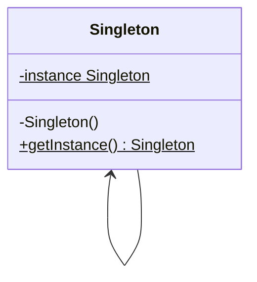

**单例模式**是一种创建型设计模式，让你能够保证一个类只有一个实例，并提供一个访问该实例的全局节点。



**单例（Singleton）** 类声明了一个名为  的静态方法来返回其所属类的一个相同实例

单例的构造函数必须对客户端（Client）代码隐藏。调用 方法必须是获取单例对象的唯一方式

<!--more-->

## 代码示例

```typescript
class Singleton {
  // 保存单例类型实例的成员变量必须被声明为静态类型
  private static instance: Singleton;
  private data: string[];

  // 单例的构造函数必须永远是私有类型，以防使用 `new` 运算符直接调用构造方法
  private constructor() {
    // 部分初始化代码
    this.data = [];
  }

  // 用于控制对单例实例的访问权限的静态方法
  public static getInstance(): Singleton {
    if (!Singleton.instance) {
      Singleton.instance = new Singleton();
    }
    return Singleton.instance;
  }

  // 任何单例都必须定义一些可以在其实例上执行的业务逻辑
  public addData(data: string): void {
    this.data.push(data);
  }

  public removeData(index: number): void {
    this.data.splice(index, 1);
  }

  public getData(): string[] {
    return this.data;
  }
}

// Example usage
const instance1 = Singleton.getInstance();
instance1.addData("Data 1");
instance1.addData("Data 2");
console.log(instance1.getData()); // Output: ["Data 1", "Data 2"]

const instance2 = Singleton.getInstance();
instance2.removeData(0);
console.log(instance2.getData()); // Output: ["Data 2"]
console.log(instance1.getData()); // Output: ["Data 2"]
```

## 适用场景

- 程序中的某个类对于所有客户端只有一个可用的实例，可以使用单例模式
- 当需要更加严格地控制全局变量时，可以使用单例模式

## 优点

- 可以保证一个类只有一个实例
- 获得一个指向该实例的全局访问节点
- 仅在首次请求单例对象时对其进行初始化

## 缺点

- 违反单一职责原则。该模式同时解决了两个问题
- 单例模式可能掩盖不良设计，比如程序各组件之间相互了解过多等
- 在多线程环境下需要进行特殊处理
- 单元的客户端单元测试可能会比较困难

## 参考

[Refactoringguru.cn 单例模式](https://refactoringguru.cn/design-patterns/factory-method)
