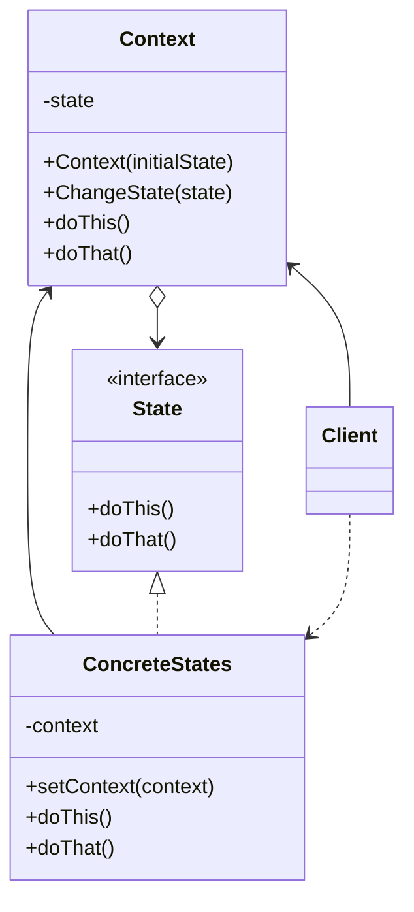

**状态模式** 是一种行为设计模式，让你能在一个对象的内部状态变化时改变其行为，使其看上去就像改变了自身所属的类一样。



<!--more-->

- **上下文（Context）** 保存了对于一个具体状态对象的引用，并会将所有与该状态相关的工作委派给它。上下文通过状态接口与状态对象交互，且会提供一个设置器用于传递新的状态对象

- **状态（State）** 接口会声明特定于状态的方法。这些方法应能被其他所有具体状态所理解，因为你不希望某些状态所拥有的方法永远不会被调用

- **具体状态（Concrete States）** 会自行实现特定于状态的方法。为了避免多个状态中包含相似代码，你可以提供一个封装有部分通用行为的中间抽象类
  状态对象可提供对于上下文对象的反向引用。状态可以通过该引用从上下文处获取所需信息，并且能触发状态转移

- 上下文和具体状态都可以设置上下文的下个状态，并可通过替换连接到上下文的状态对象来完成实际的状态转换
  
## 代码实现

  ```typescript
  interface State {
    play(): void;
    pause(): void;
    stop(): void;
  }
  
  class ReadyState implements State {
    private player: AudioPlayer;
  
    constructor(player: AudioPlayer) {
      this.player = player;
    }
  
    play(): void {
      console.log("Playing audio...");
      this.player.changeState(new PlayingState(this.player));
    }
  
    pause(): void {
      console.log("Cannot pause. Audio is not playing.");
    }
  
    stop(): void {
      console.log("Cannot stop. Audio is not playing.");
    }
  }
  
  class PlayingState implements State {
    private player: AudioPlayer;
  
    constructor(player: AudioPlayer) {
      this.player = player;
    }
  
    play(): void {
      console.log("Cannot play. Audio is already playing.");
    }
  
    pause(): void {
      console.log("Pausing audio...");
      this.player.changeState(new PausedState(this.player));
    }
  
    stop(): void {
      console.log("Stopping audio...");
      this.player.changeState(new ReadyState(this.player));
    }
  }
  
  class PausedState implements State {
    private player: AudioPlayer;
  
    constructor(player: AudioPlayer) {
      this.player = player;
    }
  
    play(): void {
      console.log("Resuming audio...");
      this.player.changeState(new PlayingState(this.player));
    }
  
    pause(): void {
      console.log("Cannot pause. Audio is already paused.");
    }
  
    stop(): void {
      console.log("Stopping audio...");
      this.player.changeState(new ReadyState(this.player));
    }
  }
  
  class AudioPlayer {
    private state: State;
  
    constructor() {
      this.state = new ReadyState(this);
    }
  
    changeState(state: State): void {
      this.state = state;
    }
  
    play(): void {
      this.state.play();
    }
  
    pause(): void {
      this.state.pause();
    }
  
    stop(): void {
      this.state.stop();
    }
  }
  
  // Usage example
  const player = new AudioPlayer();
  
  player.play(); // Output: "Playing audio..."
  player.pause(); // Output: "Pausing audio..."
  player.play(); // Output: "Resuming audio..."
  player.stop(); // Output: "Stopping audio..."
  ```

## 适用场景

- 如果对象需要根据自身当前状态进行不同行为，同时状态的数量非常多且与状态相关的代码会频繁变更的话，可使用状态模式
- 如果某个类需要根据成员变量的当前值改变自身行为，从而需要大量的条件语句时，可使用该模式
- 当相似状态和基于条件的状态机转换中存在许多重复代码时，可使用状态模式

## 优点

- 单一职责原则。将于特定状态相关的代码放在单独的类中
- 开闭原则。无需修改已有状态类和上下文就能引入新状态
- 通过消除臃肿的状态机条件语句简化上下文代码

## 缺点

- 如果状态机只有很少的几个状态，或者很少发生改变，那没应用该模式可能会显得小题大作

## 与其他模式的区别

- **** 可被视为 **** 的拓展。两者都基于组合机制：它们都通过将部分工作委派给“帮手”对象量改变其在不同情景下的行为。策略使得这些对象相互之间完全独立，它们不知道其他对象的存在。但状态模式没有限制具体状态之间的依赖，且允许它们自行改变在不同情景下的状态

## 参考

[Refactoringguru.cn 状态模式](https://refactoringguru.cn/design-patterns/state)

