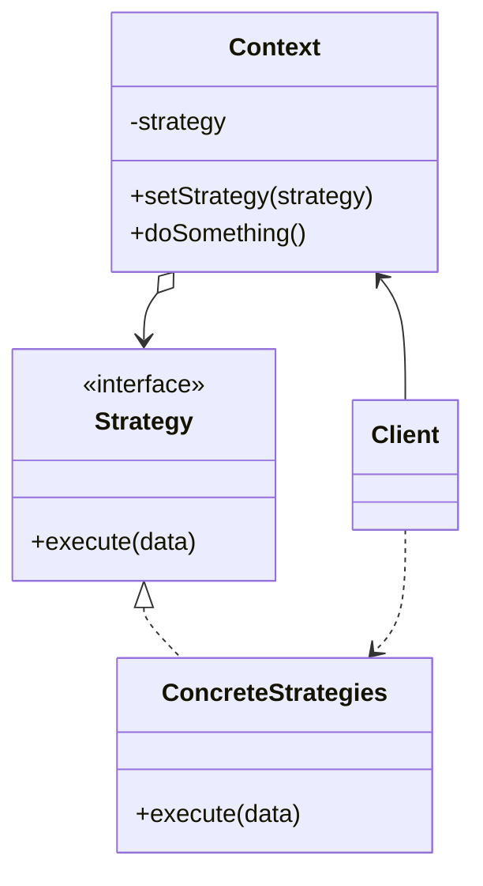

**策略模式** 是一种行为设计模式，它能让你定义一系列算法，并将每种算法分别放入独立的类中，以使算法的对象能够相互替代



<!--more-->

- **上下文（Context）** 维护指向具体策略的引用，且仅通过策略接口与该对象进行交流
- **策略（Strategy）** 接口是所有具体策略的通用接口，它声明了一个上下文用于执行策略的方法
- **具体策略（Concrete Strategies）** 实现了上下文所用算法的各种不同变体
- 当上下文需要运行算法时，它会在其已连接的策略对象上调用执行方法。上下文不清楚其所涉及的策略类型与算法的执行方式
- **客户端（Client）** 会创建一个特定策略对象并将其传递给上下文。上下文则会提供一个设置器以便客户端在运行时替换关联的策略

## 代码实现

```typescript
// Define the strategy interface
interface SortingStrategy {
  sort(data: number[]): number[];
}

// Implement concrete sorting strategies
class BubbleSort implements SortingStrategy {
  sort(data: number[]): number[] {
    // Sort the data using bubble sort algorithm
    console.log("Sorting using bubble sort");
    // ... implementation
    return data;
  }
}

class QuickSort implements SortingStrategy {
  sort(data: number[]): number[] {
    // Sort the data using quick sort algorithm
    console.log("Sorting using quick sort");
    // ... implementation
    return data;
  }
}

class MergeSort implements SortingStrategy {
  sort(data: number[]): number[] {
    // Sort the data using merge sort algorithm
    console.log("Sorting using merge sort");
    // ... implementation
    return data;
  }
}

// Context class that uses the sorting strategy
class Sorter {
  private strategy: SortingStrategy;

  constructor(strategy: SortingStrategy) {
    this.strategy = strategy;
  }

  setStrategy(strategy: SortingStrategy) {
    this.strategy = strategy;
  }

  sort(data: number[]): number[] {
    return this.strategy.sort(data);
  }
}

// Usage example
const data = [5, 1, 4, 3, 2];

const sorter = new Sorter(new BubbleSort());
sorter.sort(data);

sorter.setStrategy(new QuickSort());
sorter.sort(data);

sorter.setStrategy(new MergeSort());
sorter.sort(data);
```

## 适用场景

- 当你想使用对象中各种不同的算法变体，并希望能在运行时切换算法时，可使用策略模式。
- 当你有许多仅在执行某些行为时略有不同的相似类时，可使用策略模式
- 如果算法在上下文的逻辑中不是特别重要，使用该模式能将雷德业务逻辑与其算法实现细节隔离开来
- 当类中使用了复杂条件运算符以在同一算法的不同变体中切换时，可使用该模式

## 优点

- 可以在运行时切换对象内的算法
- 可以将算法的实现和使用算法的代码隔离开来
- 可以使用组合来替代继承
- 开闭原则。无需对上下文进行修改就能够引入新的策略

## 缺点

- 如果你的算法极少发生改变，那么没有任何理由引入新的类和接口。使用该模式只会让程序过于复杂
- 客户端必须知晓策略间的不同，它需要选择合适的策略
- 许多现代编程语言支持函数类型功能，允许你在一组匿名函数中实现不同版本的算法。这样，你使用这些函数的方式就和使用策略对象时完全相同，无需借助额外的类和接口来保持代码简洁

## 与其他模式的区别

- **** 和 **** 开上去很像，因为两者都能通过某些行为来参数化对象。但是，它们的意图有非常大的不同
  - 你可以使用命令来将任何操作转换为对象。操作的参数将成为对象的成员变量。你可以通过转换来延迟操作的执行、将操作放入队列、保持历史命令或向远程服务器发送命令等。
  - 另一方面，策略通常可用于描述完成某件事的不同方式，让你能够在同一个上下文类中切换算法
- **** 可被视为 **** 的拓展两者都基于组合机制：它们都通过将部分工作委派给“帮手”对象量改变其在不同情景下的行为。策略使得这些对象相互之间完全独立，它们不知道其他对象的存在。但状态模式没有限制具体状态之间的依赖，且允许它们自行改变在不同情景下的状态

## 参考

[Refactoringguru.cn 策略模式](https://refactoringguru.cn/design-patterns/strategy)
