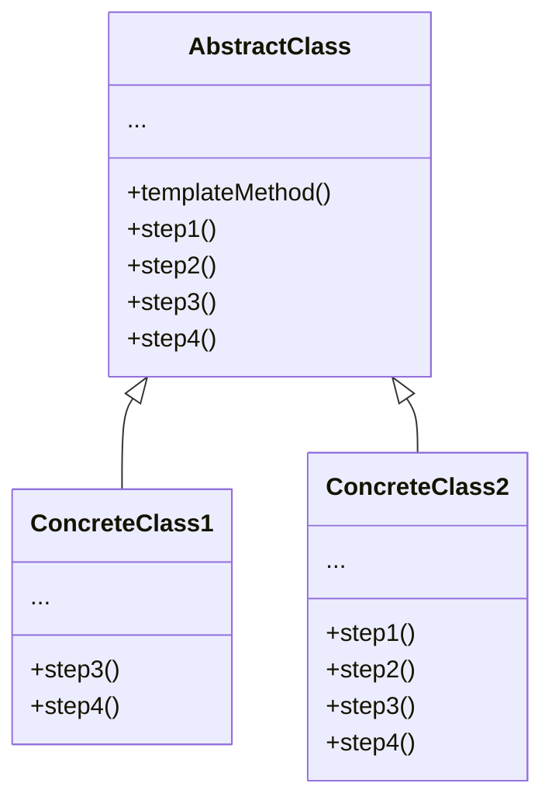

**模板方法模式** 是一种行为设计模式，它在超类中定义了一个算法的框架，允许子类在不修改结构的情况下重写算法的特定步骤



<!--more-->

- **抽象类（AbstractClass）** 会声明作为算法步骤的方法，以及依次调用它们实际的模板方法。算法步骤可以被声明为 **抽象**类型，也可以提供一些默认实现
- **具体类（ConcreteClass）** 可以重写所有步骤，但不能重写模板方法自身

## 代码实现

```typescript
abstract class DataProcessor {
  public processData(): void {
    const data = this.extractData();
    const transformedData = this.transformData(data);
    this.displayData(transformedData);
  }

  protected abstract extractData(): any[];

  protected abstract transformData(data: any[]): any[];

  protected displayData(data: any[]): void {
    console.log('Processed Data:');
    console.log(data);
  }
}

class CSVDataProcessor extends DataProcessor {
  protected extractData(): any[] {
    console.log('Extracting data from CSV file...');
    // Perform CSV data extraction logic here
    const extractedData = ['John Doe', 'Jane Smith', 'Bob Johnson'];
    return extractedData;
  }

  protected transformData(data: any[]): any[] {
    console.log('Transforming CSV data...');
    // Perform CSV data transformation logic here
    const transformedData = data.map((name) => ({ name }));
    return transformedData;
  }
}

class JSONDataProcessor extends DataProcessor {
  protected extractData(): any[] {
    console.log('Extracting data from JSON file...');
    // Perform JSON data extraction logic here
    const extractedData = [
      { name: 'John Doe', age: 30 },
      { name: 'Jane Smith', age: 25 },
      { name: 'Bob Johnson', age: 35 }
    ];
    return extractedData;
  }

  protected transformData(data: any[]): any[] {
    console.log('Transforming JSON data...');
    // Perform JSON data transformation logic here
    const transformedData = data.map((person) => person.name);
    return transformedData;
  }
}

// Client code
const csvDataProcessor = new CSVDataProcessor();
csvDataProcessor.processData();

console.log('---');

const jsonDataProcessor = new JSONDataProcessor();
jsonDataProcessor.processData();

/**
Extracting data from CSV file...
Transforming CSV data...
Processed Data:
[ { name: 'John Doe' }, { name: 'Jane Smith' }, { name: 'Bob Johnson' } ]
---
Extracting data from JSON file...
Transforming JSON data...
Processed Data:
[ 'John Doe', 'Jane Smith', 'Bob Johnson' ]
*/
```

## 适用场景

- 当你只希望客户端拓展某个特定算法步骤，而不是整个算法或其结构时，可使用模板方法模式
- 当多个类的算法除一些细微不同之外几乎完全一样时，你可使用该模式。但其后果就是，只要算法发生变化，你就可能需要修改所有的类

## 优点

- 你可仅允许客户端重写一个大型算法中的特定部分，使得算法其他部分修改对其所造成的影响减小
- 你可将重复代码提取到一个超类中

## 缺点

- 部分客户端可能会受到算法框架的限制
- 通过子类抑制默认步骤实现可能会导致违反里氏替换原则
- 模板方法中的步骤越多，其维护工作中就可能会越困难

## 与其他模式的关系

- 是 **模板方法模式** 的一种特殊形式。同时，工厂方法可以作为一个大型模板方法中的一个步骤

## 参考

[Refactoringguru.cn 模板方法模式](https://refactoringguru.cn/design-patterns/template-method)
