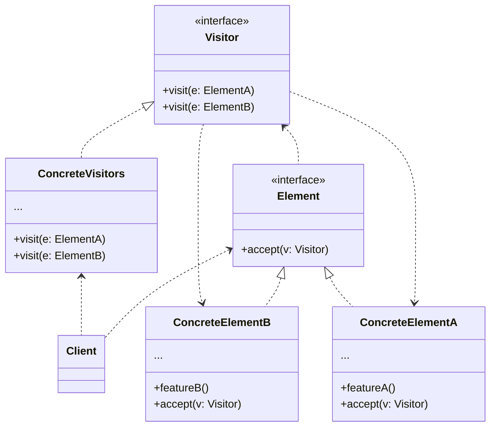

**访问者模式** 是一种行为设计模式，它能将算法与其作用的对象隔离开来



<!--more-->

- **访问者（Visitor）** 接口声明了一系列以对象结果的具体元素为参数的访问者方法。如果编程语言支持重载，这些方法的名称可以是相同的，但是其参数一定是不同的
- **具体访问者（Concrete Visitor）** 会为不同的具体元素类实现相同行为的几个不同版本
- **元素（Element）** 接口声明了一个方法来“接收”访问者。该方法必须有一个参数本声明为访问者接口类型
- **具体元素（Concrete Element）** 必须实现接收方法。该方法的目的是根据当前元素类将其调用重定向到相应访问者的方法。请注意，即使元素基类实现了该方法，所有子类都必须对其进行重写并调用访问者对象中的合适方法
- **客户端（Client）** 通常会作为集合或其他复杂对象（例如一个树）的代表。客户端通常不知晓所有的具体元素类，因为它们会通过抽象接口与集合中的对象进行交互

## 代码实现

```typescript
interface Visitable {
  accept(visitor: Visitor): void;
}

class Circle implements Visitable {
  public radius: number;

  constructor(radius: number) {
    this.radius = radius;
  }

  public accept(visitor: Visitor): void {
    visitor.visitCircle(this);
  }
}

class Rectangle implements Visitable {
  public width: number;
  public height: number;

  constructor(width: number, height: number) {
    this.width = width;
    this.height = height;
  }

  public accept(visitor: Visitor): void {
    visitor.visitRectangle(this);
  }
}

interface Visitor {
  visitCircle(circle: Circle): void;
  visitRectangle(rectangle: Rectangle): void;
}

class AreaVisitor implements Visitor {
  public visitCircle(circle: Circle): void {
    const area = Math.PI * circle.radius * circle.radius;
    console.log(`Area of circle with radius ${circle.radius}: ${area}`);
  }

  public visitRectangle(rectangle: Rectangle): void {
    const area = rectangle.width * rectangle.height;
    console.log(`Area of rectangle with width ${rectangle.width} and height ${rectangle.height}: ${area}`);
  }
}

class PerimeterVisitor implements Visitor {
  public visitCircle(circle: Circle): void {
    const perimeter = 2 * Math.PI * circle.radius;
    console.log(`Perimeter of circle with radius ${circle.radius}: ${perimeter}`);
  }

  public visitRectangle(rectangle: Rectangle): void {
    const perimeter = 2 * (rectangle.width + rectangle.height);
    console.log(`Perimeter of rectangle with width ${rectangle.width} and height ${rectangle.height}: ${perimeter}`);
  }
}

const shapes: Visitable[] = [
  new Circle(5),
  new Rectangle(3, 4),
  new Circle(7)
];

const areaVisitor: Visitor = new AreaVisitor();
const perimeterVisitor: Visitor = new PerimeterVisitor();

for (const shape of shapes) {
  shape.accept(areaVisitor);
  shape.accept(perimeterVisitor);
}
```

## 适用场景

- 如果你需要对一个复杂对象结构（例如对象树）中的所有元素执行某些操作，可使用访问者模式
- 可使用访问者模式来清理辅助行为的业务逻辑
- 当某个行为仅在类层次结构中的一些类中有意义，而在其他类中没有意义是，可使用该模式

## 优点

- 开闭原则。你可以引入在不同类对象上执行的新行为，且无需对这些类做出修改
- 单一职责原则。可将同一行为的不同版本移到同一个类中
- 访问者对象可以在与各种对象交互时收集一些有用的信息。当你想要遍历一些复杂的对象结构（例如对象树），并在结构中的每个对象上应用访问者时，这些信息可能会有所帮助

## 缺点

- 每次在元素层次结构中添加或移除一个类时，你都要更新所有的访问者
- 在访问者同某个元素进行交互时，它们可能没有访问元素私有成员变量和方法的必要权限

## 参考

[Refactoringguru.cn 访问者模式](https://refactoringguru.cn/design-patterns/visitor)
