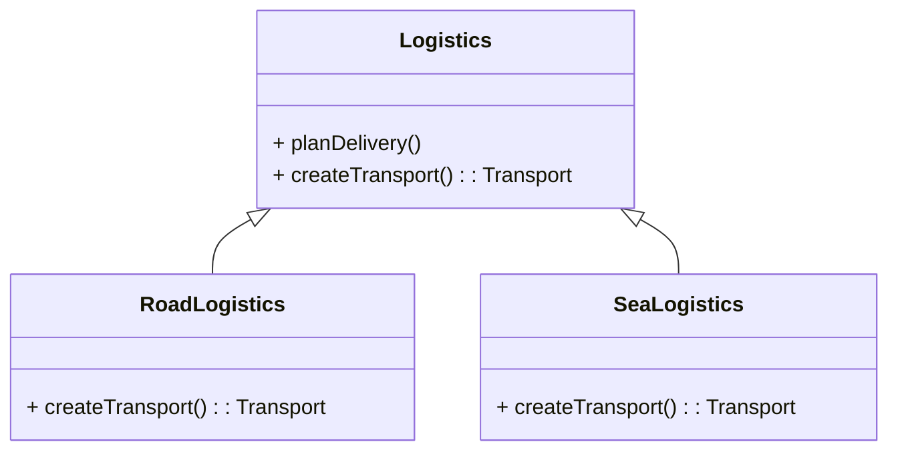
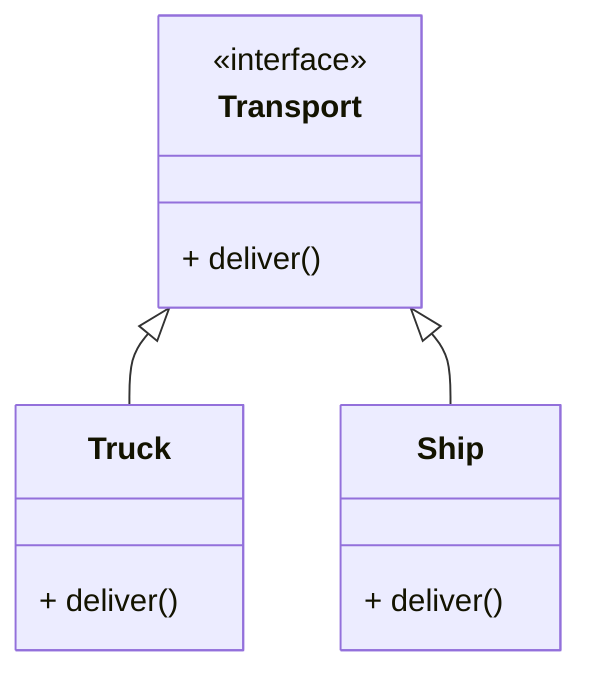

工厂方法模式是一种创建型设计模式,其在父类中提供一个创建对象的方法,允许子类决定实例化对象的类型.

工厂方法模式建议使用特殊的工厂方法代替对于对象构造函数的直接调用(即使用  运算符).不用担心,对象仍将通过运算符创建,只是该运算符改在工厂方法中调用罢了.

工厂方法返回的对象通常被称作“产品”



<!--MORE-->

-  物流工厂类

-  陆路物流工厂类, 重写工厂方法, 创建陆路运输工具(车)

-  水路物流工厂类, 重写工厂方法, 创建水路运输工具(船)

需要注意, 工厂方法创建的产品需要具有共同的基类或者接口.  应将其返回类型声明为这一共有接口





必须要理解为什么返回的是通用接口,而不是具体的产品类实例. 

如果返回具体产品类实例, 创建方法就与具体产品之间产生了耦合. 此时, 你已经预知了需要的对象的确切类别和具体关系. 而工厂方法一般是在无法预知这两者时使用. 并且这样做也不利于用户拓展, 用户无法知道原有产品内部的逻辑, 当其想拓展另一种产品时, 根本无从下手. (返回通用接口时, 用户只需要编写满足接口要求的实现即可, 无需考虑已有的产品)



## 代码示例

```typescript
// 产品接口, 工厂方法创建的产品需要实现该接口
interface Product {
  getName(): string;
  getPrice(): number;
}

// 产品
class BasicProduct implements Product {
  private name: string;
  private price: number;

  constructor(name: string, price: number) {
    this.name = name;
    this.price = price;
  }

  public getName(): string {
    return this.name;
  }

  public getPrice(): number {
    return this.price;
  }
}

// 另一种产品
class DiscountedProduct implements Product {
  private name: string;
  private price: number;
  private discountRate: number;

  constructor(name: string, price: number, discountRate: number) {
    this.name = name;
    this.price = price;
    this.discountRate = discountRate;
  }

  public getName(): string {
    return this.name;
  }

  public getPrice(): number {
    return this.price * (1 - this.discountRate);
  }
}

// 工厂基类(接口), 这里只有工厂方法, 也可以使用基类的方式. 额外定义产品的消费等
interface ProductFactory {
  createProduct(name: string): Product; // 注意返回值, 为产品实现的接口
}

// 产品工厂
class BasicProductFactory implements ProductFactory {
  createProduct(name: string): Product {
    return new BasicProduct(name, 10);
  }
}

// 另一种产品工厂
class DiscountedProductFactory implements ProductFactory {
  createProduct(name: string): Product {
    return new DiscountedProduct(name, 10, 0.2);
  }
}

// App
enum ProductType {
  BASIC,
  DISCOUNTED
}

class ProductStore {
  private productFactories: Map<ProductType, ProductFactory>;

  constructor() {
    this.productFactories = new Map();
    this.productFactories.set(ProductType.BASIC, new BasicProductFactory());
    this.productFactories.set(ProductType.DISCOUNTED, new DiscountedProductFactory());
  }
// 注意返回值, 为产品实现的接口
  public buyProduct(productType: ProductType, name: string): Product {
    const productFactory = this.productFactories.get(productType);
    if (!productFactory) {
      throw new Error(`Unsupported product type: ${productType}`);
    }
    return productFactory.createProduct(name);
  }
}

const store = new ProductStore();

const basicProduct = store.buyProduct(ProductType.BASIC, "Basic Product");
const discountedProduct = store.buyProduct(ProductType.DISCOUNTED, "Discounted Product");

console.log(basicProduct.getName(), basicProduct.getPrice());
console.log(discountedProduct.getName(), discountedProduct.getPrice());
```


## 适用场景

- 当无法预知对象确切类别及其依赖关系时, 可使用工厂方法
- 希望用户能够拓展你的软件库或框架的内部组件, 可使用工厂方法
- 希望复用现有对象来节省系统资源,而不是每次都重新创建对象, 可使用工厂方法

## 优点

- 可以避免创建者和具体产品之间的紧密耦合
- 单一职责原则.可以将产品创建代码放在程序的单一位置,从而使得代码更容易维护
- 开闭原则.无需更改现有客户端代码就可以在程序中引入新的产品类型

## 缺点

- 需要引入许多新的子类,代码可能会因此变得更复杂. 最好的情况是将该模式引入创建者类的现有层次结构中

## 参考

[Refactoringguru.cn 工厂方法模式](https://refactoringguru.cn/design-patterns/factory-method)

